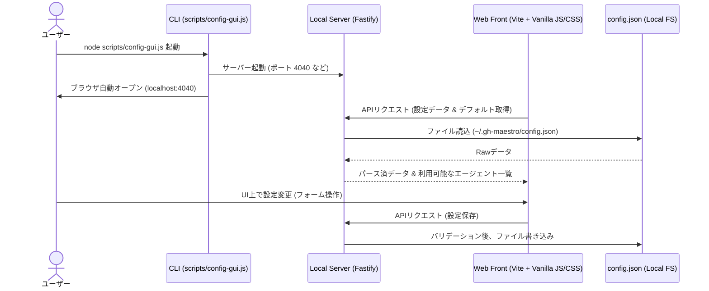

# gh-maestro Config GUI 導入計画書

`gh-maestro` の設定ファイルである `config.json`（グローバルおよびワークスペース固有）を視覚的かつ安全に編集するための GUI ツール導入計画です。

---

## 1. 背景と目的

現在 `gh-maestro` のワーカー割り当てやカスタムエージェントの設定は `config.json` を直接編集することで行われています。しかし、以下の課題があります。

- スキル名（`gh-maestro-coder` など）やエージェントID（`claude-ds` など）のタイポによる設定エラー。
- ワークスペース固有の `config.json` では `command` や `extraArgs` を上書きできないというセキュリティ制約（`scripts/shared/resolve-config.js`）が、テキスト編集では分かりにくい。
- エージェントがログインシェル上で解決可能かどうか（パスが通っているか）を事前に確認しづらい。

これらを解決するため、視覚的・直感的に設定をバリデーションしながら編集できる GUI ツールを導入します。

---

## 2. 実装アプローチ

本計画では、ポータビリティと開発コストの観点から **「CLI統合型 ローカル Web UI」** を第一候補として定義します。

### 構成 1: CLI統合型 ローカル Web UI (推奨)
`npx gh-maestro config` または `node scripts/config-gui.js` コマンドで軽量なローカルサーバーを起動し、ブラウザ上で操作する方式です。

### 構成 2: VS Code 拡張機能 (将来的なロードマップ)
VS Code 内のカスタムエディタ（Webview Panel）として動作させる方式です。VS Code に完全に統合されるため、開発体験（DX）が非常に高くなります。

---

## 3. 技術スタック (CLI統合型 Web UI)

| レイヤー | 使用技術 | 選定理由 |
| :--- | :--- | :--- |
| **バックエンド** | **Node.js + Fastify** | プロジェクトの標準ランタイム。軽量でスキーマバリデーション（Ajv）が容易なため安全に JSON を更新可能。 |
| **フロントエンド** | **Vite + Javascript (ESM)** | 超高速な開発環境。余計なUIフレームワークに依存せず、軽量かつ高いコントロール性を持つ。 |
| **スタイリング** | **Vanilla CSS (HSL + CSS Variables)** | 最高のコントロール性と柔軟性。高級感のあるダークモードとネオンアクセントを最小サイズで実装。 |
| **エディタコンポーネント** | **Monaco Editor (CDN版)** | JSON Raw ビュー用に VS Code と同じエディタを埋め込み、自動補完やシンタックスエラー検出を提供。 |

---

## 4. UI/UX & デザインガイドライン

開発者のモチベーションを高め、操作ミスを防ぐためのプレミアムなデザインシステムを構築します。

### A. ビジュアルテーマ
- **背景カラー**: Sleek Dark (`#0b0f19` などの深みのあるブルーグレー系)
- **アクセント**: ネオンカラー（Antigravityのブランドカラーに調和するバイオレット、エメラルドグリーン）
- **マテリアル**: グラスモルフィズム（背景のぼかし）、スムーズなホバー・トランジション効果。
- **タイポグラフィ**: `JetBrains Mono` や `Outfit`, `Inter` などのクリーンなサンセリフフォント。

### B. 機能的デザイン
1. **デュアルビューレイアウト**:
   画面左側に「スキルのマッピング（ドロップダウン）」や「エージェント設定（入力フォーム）」を並べ、右側にはリアルタイムで同期してシンタックスハイライトされる「JSON プレビュー」を表示。
2. **セキュリティ・フィードバック (重要)**:
   ワークスペース固有の `config.json` を編集している際、`command` や `extraArgs` に相当する入力フィールドは自動的に無効化（Disabled）し、ロックアイコンと共に「**実行コマンドの変更はグローバル設定でのみ許可されています**」という警告をトーストまたはツールチップで明示。
3. **エージェント・テスター**:
   エージェント定義ごとに「Test Launch」ボタンを配置し、バックエンドが実際にログインシェル上でその `command` が呼び出せるか（`scripts/agent-exec.js`の`checkAgentExists`）を非同期検証してステータスを表示。

---

## 5. セキュリティ設計

- **ローカル限定の接続**: サーバーは `localhost` (`127.0.0.1`) のみにバインドし、外部からの不正アクセスを遮断。
- **CSRF 対策**: 起動時に動的にワンタイムトークンを生成し、フロントエンドからのAPIリクエストのヘッダーに付与させることで不正なブラウザ操作を防止。
- **厳格なスキーマ検証**: ユーザーから送信されたJSONデータは、書き込み前に `agent-defaults.json` のスキーマに基づいて検証し、壊れた JSON やスクリプトインジェクションを防ぐ。

---

## 6. 実装フェーズ

### フェーズ 1: API / CLI 設計 (Back-end)
- `scripts/config-gui.js` のプロトタイプ作成（Fastify サーバーの起動、ブラウザ起動連携）。
- 設定のロード、保存、エージェント疎通テスト（`checkAgentExists`）を行う API エンドポイントの実装。

### フェーズ 2: UI構築 (Front-end)
- Vite を用いた SPA プロジェクトの構成。
- ダークモード前提の Vanilla CSS スタイルの適用。
- ドロップダウンによるマッピング選択と、追加エージェントの作成フォーム構築。

### フェーズ 3: 結合テスト・配布
- `npm test` に GUI サーバー疎通テスト・スキーマ検証テストを追加。
- `npx gh-maestro config` から立ち上がるようにパッケージング（`package.json` への bin/scripts 登録）。
