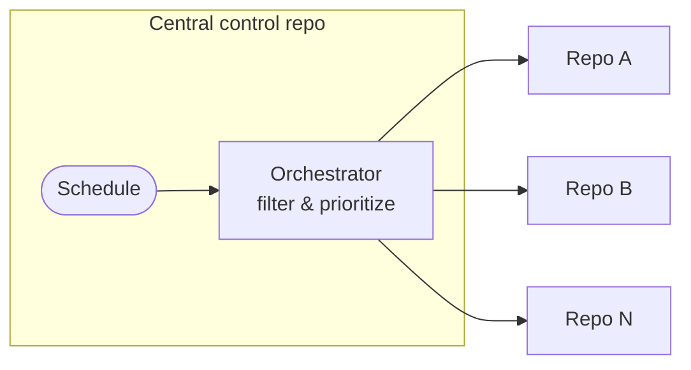
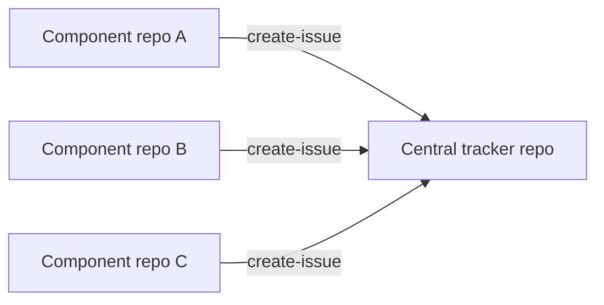

---
title: CentralRepoOps
description: Coordinate agentic workflows across multiple repositories using a central repository as a control plane for org-wide rollouts or as a shared tracker for aggregated visibility.
sidebar:
  badge: { text: 'Advanced', variant: 'caution' }
---

CentralRepoOps uses a single central repository to coordinate or aggregate activity across many other repositories. It is a sub-pattern of [MultiRepoOps](/gh-aw/patterns/multi-repo-ops/) and covers two deployment models: a **central control plane** where one repo dispatches work to many target repos for org-wide rollouts, security patches, and policy enforcement; and a **central tracker repo** where component repos each push events into a shared tracker for aggregated visibility and cross-project dashboards.

## Using a Central Control Repository

For large-scale operations — security patches, policy rollouts, configuration standardization — use a **single private repository as a control plane**. An orchestrator workflow filters and prioritizes targets, then dispatches per-repo worker workflows.



This pattern supports phased adoption (pilot waves first), central governance, security-aware prioritization, and a complete decision trail — without pushing `main` changes to individual target repositories.

**Orchestrator** (`dispatch-workflow` safe output + `max` limit):
```aw wrap
---
on:
  schedule: weekly on monday

tools:
  github:
    github-token: ${{ secrets.GH_AW_READ_ORG_TOKEN }}
    toolsets: [repos]

safe-outputs:
  dispatch-workflow:
    workflows: [worker-workflow]
    max: 5
---

# Rollout Orchestrator

Filter repositories, categorize by complexity, prioritize the rollout order, and dispatch the worker workflow for each selected repository. Summarize candidates, breakdown, and rationale.
```

**Worker** (`checkout` + `target-repo` safe outputs per dispatched repo):
```aw wrap
---
on:
  workflow_dispatch:
    inputs:
      target_repo:
        description: 'Target repository (owner/repo format)'
        required: true
        type: string

checkout:
  repository: ${{ github.event.inputs.target_repo }}
  github-token: ${{ secrets.ORG_REPO_CHECKOUT_TOKEN }}
  current: true

safe-outputs:
  github-token: ${{ secrets.GH_AW_CROSS_REPO_PAT }}
  create-pull-request:
    target-repo: ${{ github.event.inputs.target_repo }}
    max: 1
---

# Worker: Apply Changes to Target Repository

Analyze ${{ github.event.inputs.target_repo }}, apply the required changes, and create a pull request explaining what was changed and why.
```

Keep orchestrator permissions narrow; delegate repo-specific writes to workers. Add correlation IDs to dispatch inputs for tracking. See the [Dependabot Rollout example](/gh-aw/examples/multi-repo/dependabot-rollout/) for a complete end-to-end walkthrough.

## Using a Central Tracker Repository

Each component repository runs its own workflow that forwards events to a central tracker repo via `target-repo`. The central repository accumulates a unified view without needing direct access to individual component repos.



Useful for component-based architectures where multiple teams need a shared visibility layer, cross-project initiatives, or aggregating metrics from distributed repositories. See [Cross-Repo Issue Tracking](/gh-aw/examples/multi-repo/issue-tracking/) for a complete example.

## Related Documentation

- [MultiRepoOps](/gh-aw/patterns/multi-repo-ops/) — Side repo and downstream sync patterns
- [Dependabot Rollout](/gh-aw/examples/multi-repo/dependabot-rollout/) — End-to-end org-wide rollout example
- [Cross-Repo Issue Tracking](/gh-aw/examples/multi-repo/issue-tracking/) — Aggregated issue tracking example
- [Cross-Repository Safe Outputs](/gh-aw/reference/cross-repository/) — Configuration reference
- [Authentication](/gh-aw/reference/auth/) — PAT and GitHub App setup
