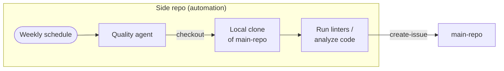

---
title: 'Example: Code Quality Monitoring'
description: Run weekly code quality analysis on a main repository from a side repository, checking out the code locally to run linters and producing actionable issues.
sidebar:
  badge: { text: 'Multi-Repo', variant: 'note' }
---

This example shows how to run weekly code quality checks on `my-org/main-repo` from a dedicated side repository. The agent checks out the target repository, runs linters and complexity analysis locally, and creates prioritized issues in the main repo — keeping automation infrastructure entirely separate from the codebase it monitors.

## How It Works



The agent:
1. Checks out `main-repo` into the workflow runner
2. Runs linters, counts complexity, and scans for security patterns
3. Creates focused, actionable issues in the main repo for significant findings

## Setup

### 1. Create the Side Repository

```bash
gh repo create my-org/main-repo-quality --private
gh repo clone my-org/main-repo-quality
cd main-repo-quality
```

### 2. Create the Authentication Token

Create a fine-grained PAT (`GH_AW_MAIN_REPO_TOKEN`) scoped **only to `my-org/main-repo`** with these permissions:

| Permission | Level | Purpose |
|------------|-------|---------|
| Contents | Read-only | Checkout the repository |
| Issues | Read & write | Create quality issues |

Store it as a secret in the **side repository**:

```bash
gh secret set GH_AW_MAIN_REPO_TOKEN --repo my-org/main-repo-quality
```

> [!NOTE]
> The default `GITHUB_TOKEN` cannot access other repositories. The explicit token must be set on both `checkout` and `safe-outputs`.

For enhanced security, use a [GitHub App token](/gh-aw/reference/auth/#using-a-github-app-for-authentication) — minted on demand and automatically revoked after each job.

### 3. Create the Workflow

In the side repository, create `.github/workflows/code-quality.md`:

````aw wrap
---
on: weekly on monday

permissions:
  contents: read

checkout:
  repository: my-org/main-repo
  github-token: ${{ secrets.GH_AW_MAIN_REPO_TOKEN }}
  path: repo
  current: true

tools:
  github:
    github-token: ${{ secrets.GH_AW_MAIN_REPO_TOKEN }}
    toolsets: [repos, pull_requests]
  bash:
    - "npx:*"
    - "eslint:*"
    - "pip:*"

safe-outputs:
  github-token: ${{ secrets.GH_AW_MAIN_REPO_TOKEN }}
  create-issue:
    target-repo: "my-org/main-repo"
    title-prefix: "[quality] "
    labels: [code-quality, automation]
    max: 10

---

# Weekly Code Quality Review

The target repository has been checked out to `${{ github.workspace }}/repo`. Start by navigating there:

```
cd ${{ github.workspace }}/repo
```

## What to Analyze

### 1. JavaScript / TypeScript (if package.json exists)

```bash
npx eslint . --format json --max-warnings 0 2>/dev/null | head -200
```

Look for:
- Files with >5 ESLint errors (flag for immediate fix)
- Patterns that indicate missing error handling (`catch(e) {}`, empty catch blocks)
- Unused imports and variables accumulating across many files

### 2. Complexity (any language)

Count lines per file and flag files over 500 lines — they are candidates for splitting. Use `wc -l` on source files:

```bash
find . -name "*.ts" -o -name "*.js" -o -name "*.py" | xargs wc -l | sort -rn | head -20
```

### 3. Python (if requirements.txt or pyproject.toml exists)

```bash
pip install flake8 --quiet && flake8 . --count --statistics 2>/dev/null | tail -20
```

Flag modules with >10 flake8 errors.

### 4. Dependency staleness

Check for packages with known security advisories using GitHub tools — look at open Dependabot alerts on `my-org/main-repo`.

### 5. Recent PR patterns

Use GitHub tools to look at the last 10 merged PRs. Note recurring themes: are tests consistently skipped? Are the same files always modified together (coupling indicator)?

## What to Create

Create **one issue per distinct finding category** (not one issue per file). Each issue should:

- Name the specific files or modules involved (link to them via GitHub URL)
- Explain why it matters (performance, maintainability, security)
- Suggest a concrete first step to address it
- Include a severity: High (security/crashes), Medium (maintainability), Low (style)

Skip findings with fewer than 3 instances — they are not worth the noise.

## What to Skip

Do not create issues for:
- Style preferences without an established linter rule
- Files with a `// quality-exempt` comment
- Test files (`*.test.*`, `*.spec.*`, `__tests__/`)
````

Compile: `gh aw compile`.

## Customizing the Analysis

### Running Type Checkers

Add TypeScript checking to the bash tools and prompt:

```aw wrap
---
tools:
  bash:
    - "npx:*"
    - "tsc:*"
---
# ...
Run `npx tsc --noEmit 2>&1 | head -50` and flag any type errors in non-test files.
```

### Targeting a Specific Directory

Use `path:` in checkout and navigate into a subdirectory:

```aw wrap
---
checkout:
  repository: my-org/monorepo
  github-token: ${{ secrets.GH_AW_MAIN_REPO_TOKEN }}
  path: repo
  current: true
---
# ...
Navigate to `${{ github.workspace }}/repo/packages/api` and run analysis only on that package.
```

### Checking Out Multiple Repositories

Compare quality trends across related repos:

```aw wrap
---
checkout:
  - repository: my-org/service-alpha
    path: alpha
    github-token: ${{ secrets.GH_AW_MAIN_REPO_TOKEN }}
  - repository: my-org/service-beta
    path: beta
    github-token: ${{ secrets.GH_AW_MAIN_REPO_TOKEN }}
    current: true  # Issues created here
---
# ...
Compare complexity metrics between alpha/ and beta/ and create a comparative report issue.
```

## Important: `current: true` and Working Directory

`current: true` tells the agent which repository to treat as the primary target for GitHub operations (issue creation, PR references). It does **not** automatically change the working directory. Always include an explicit `cd` in the prompt:

```
cd ${{ github.workspace }}/repo
```

Without it, the agent starts in `$GITHUB_WORKSPACE` (the side repo) and may analyze the wrong directory.

## Related Documentation

- [MultiRepoOps](/gh-aw/patterns/multi-repo-ops/) — Side repository pattern and other topologies
- [Triage from Side Repo](/gh-aw/examples/multi-repo/triage-from-side-repo/) — Issue triage from a side repo
- [Cross-Repository Operations](/gh-aw/reference/cross-repository/) — Checkout configuration and `current: true`
- [Authentication](/gh-aw/reference/auth/) — PAT and GitHub App setup
- [Safe Outputs](/gh-aw/reference/safe-outputs/) — Issue creation with `max` and labels
