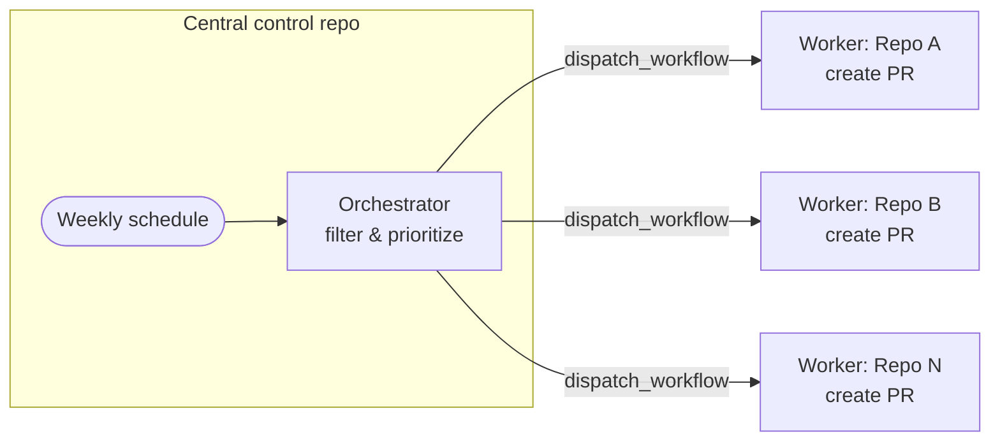

---
title: 'Example: Dependabot Rollout'
description: Roll out a customized Dependabot configuration across many repositories using an orchestrator and worker workflow pair from a central control repository.
sidebar:
  badge: { text: 'Multi-Repo', variant: 'note' }
---

This example shows how to roll out a new Dependabot configuration across 100 repositories using the [central control plane pattern](/gh-aw/patterns/central-repo-ops/#using-a-central-control-repository). An **orchestrator** workflow filters and prioritizes target repositories, then dispatches a **worker** workflow that analyzes each repo and creates an intelligently customized pull request.

Both workflows live in a single private control repository.

## How It Works



1. The orchestrator runs weekly, scans org repos, skips ones that already have Dependabot configured, and dispatches up to 5 workers per run.
2. Each worker checks out the target repo, analyzes its structure, and creates a customized `dependabot.yml` pull request — or opens an issue if Renovate or other conflicts are detected.

## Setup

### 1. Create the Orchestrator

In your central control repository, create `.github/workflows/dependabot-rollout-orchestrator.md`:

```aw wrap
---
on:
  schedule: weekly on monday

tools:
  github:
    github-token: ${{ secrets.GH_AW_READ_ORG_TOKEN }}
    toolsets: [repos]

safe-outputs:
  dispatch-workflow:
    workflows: [dependabot-rollout]
    max: 5
---

# Dependabot Rollout Orchestrator

Categorize and orchestrate Dependabot rollout across repositories.

**Target repos**: All repos in the organization

## Task

1. **Filter** - Parse repos (from input or variable), check each for existing `.github/dependabot.yml`, keep only repos without it

2. **Categorize** - Read repo contents to assess complexity:
   - Simple: Single package.json, <50 dependencies, standard structure
   - Complex: Multiple package.json files, >100 deps, or multiple ecosystems
   - Conflicting: Has Renovate config or custom update scripts
   - Security: Open security alerts or public with dependencies

3. **Prioritize** - Order repos by rollout preference: simple → security → complex → conflicting

4. **Dispatch** - Dispatch `dependabot-rollout` worker for every prioritized repository

5. **Summarize** - Report total candidates, categorization breakdown, selected repos with rationale
```

Compile this workflow: `gh aw compile`. Then create the `GH_AW_READ_ORG_TOKEN` secret — a fine-grained PAT with `Contents: Read-only` scoped to all target repositories. See [Authentication](/gh-aw/reference/auth/) for PAT and GitHub App setup.

### 2. Create the Worker

Create the worker workflow `.github/workflows/dependabot-rollout.md` in the same central repository. It checks out each target repo via `checkout:` and creates a customized PR (or issue) via cross-repo safe outputs:

````aw wrap
---
on:
  workflow_dispatch:
    inputs:
      target_repo:
        description: 'Target repository (owner/repo format)'
        required: true
        type: string

run-name: Dependabot rollout for ${{ github.event.inputs.target_repo }}

concurrency:
  group: gh-aw-${{ github.workflow }}-${{ github.event.inputs.target_repo }}

engine:
  concurrency:
    group: gh-aw-copilot-${{ github.workflow }}-${{ github.event.inputs.target_repo }}

checkout:
  repository: ${{ github.event.inputs.target_repo }}
  github-token: ${{ secrets.ORG_REPO_CHECKOUT_TOKEN }}
  current: true

permissions:
  contents: read
  issues: read
  pull-requests: read

tools:
  github:
    github-token: ${{ secrets.GH_AW_READ_ORG_TOKEN }}
    toolsets: [repos]

safe-outputs:
  github-token: ${{ secrets.GH_AW_CROSS_REPO_PAT }}
  create-pull-request:
    target-repo: ${{ github.event.inputs.target_repo }}
    title-prefix: '[dependabot] '
    max: 1
  create-issue:
    target-repo: ${{ github.event.inputs.target_repo }}
    title-prefix: '[dependabot-config] '
    max: 1
---

# Intelligent Dependabot Configuration

You are creating a **customized** Dependabot configuration based on analyzing this specific repository.

**Target Repository**: ${{ github.event.inputs.target_repo }}

## Why AI is Required

You must analyze the repository structure and create an intelligent, customized configuration - not a generic template.

## Step 1: Analyze Repository

**Check for conflicts:**

- Does `.github/dependabot.yml` already exist? → Stop, create issue explaining it exists
- Does `.github/renovate.json` or `renovate.json` exist? → Create issue about migrating from Renovate
- Are there custom dependency update scripts? → Create issue suggesting Dependabot alternative

**Analyze package manager complexity:**

For **npm** (if package.json exists):

- Count total dependencies (dependencies + devDependencies)
- Check for monorepo: Are there multiple package.json files in subdirectories?
- Simple: <20 dependencies, single package.json
- Complex: >100 dependencies OR monorepo structure

For **Python** (requirements.txt, setup.py, pyproject.toml):

- Count dependencies
- Check for multiple requirement files

For **Go** (go.mod):

- Note if present

For **GitHub Actions** (.github/workflows/*.yml):

- Count workflow files

**Security context:**

- Use GitHub tools to check for open security alerts
- If critical alerts exist, prioritize security updates

## Step 2: Create Customized Configuration

Based on your analysis, create an appropriate config:

### Simple Repository (<20 npm deps, no monorepo)

```yaml
version: 2
updates:
  - package-ecosystem: "npm"
    directory: "/"
    schedule:
      interval: "daily"  # Low complexity = more frequent
  - package-ecosystem: "github-actions"
    directory: "/"
    schedule:
      interval: "weekly"
```

### Complex Repository (>100 deps OR security alerts)

```yaml
version: 2
updates:
  - package-ecosystem: "npm"
    directory: "/"
    schedule:
      interval: "weekly"  # High complexity = less frequent
    groups:
      production:
        patterns: ["*"]
        exclude-patterns: ["@types/*", "@jest/*"]
      dev-dependencies:
        patterns: ["@types/*", "@jest/*", "eslint*"]
```

### Monorepo (multiple package.json)

```yaml
version: 2
updates:
  - package-ecosystem: "npm"
    directory: "/packages/frontend"
    schedule:
      interval: "weekly"
  - package-ecosystem: "npm"
    directory: "/packages/backend"
    schedule:
      interval: "weekly"
```

## Step 3: Deliver Configuration

**If config is straightforward (no Renovate conflict):**

- Create `.github/dependabot.yml` with your customized config
- Create pull request with:
  - Title: "[dependabot] Add customized Dependabot configuration"
  - Body explaining: dependency count, why weekly vs daily, grouping strategy, etc.

**If Renovate detected:**

- Create issue explaining migration benefits and proposed config
- Include generated config in issue body

**If no package managers found:**

- Create issue: "No supported package managers detected"

## Key: Explain Your Reasoning

In the PR/issue body, explain **why** you chose this specific configuration (not a generic template).
````

Compile: `gh aw compile`.

### 3. Create Secrets

Create two fine-grained PATs scoped to target repositories (see [Authentication](/gh-aw/reference/auth/) for full setup):

| Secret | Permissions | Purpose |
|--------|-------------|---------|
| `ORG_REPO_CHECKOUT_TOKEN` | `Contents: Read & write`, `Actions: Read & write` | Checkout target repos |
| `GH_AW_CROSS_REPO_PAT` | `Contents: Write`, `Issues: Write`, `Pull Requests: Write` | Create PRs and issues |
| `GH_AW_READ_ORG_TOKEN` | `Contents: Read-only` | Read org repos in orchestrator and worker |

## Running the Rollout

After setup, the orchestrator runs automatically every Monday, processing up to 5 repositories per run. To trigger manually:

```bash
gh workflow run dependabot-rollout-orchestrator.lock.yml
```

Track progress by reviewing the Actions runs and the PRs created in each target repository.

## Best Practices

- Keep `max: 5` on the orchestrator during initial rollout; increase once you've validated the worker output
- Add `[dependabot]` title-prefix to make PRs easy to filter across repositories
- Use `concurrency` groups to prevent duplicate worker runs for the same target repo
- Review a few worker PRs manually before trusting the full automation

## Related Documentation

- [MultiRepoOps](/gh-aw/patterns/multi-repo-ops/) — Central control plane pattern and other topologies
- [Feature Synchronization](/gh-aw/examples/multi-repo/feature-sync/) — Upstream-to-downstream sync example
- [Cross-Repository Issue Tracking](/gh-aw/examples/multi-repo/issue-tracking/) — Hub-and-spoke tracking example
- [Cross-Repository Operations](/gh-aw/reference/cross-repository/) — Checkout and `target-repo` configuration
- [Authentication](/gh-aw/reference/auth/) — PAT and GitHub App setup
- [Safe Outputs](/gh-aw/reference/safe-outputs/) — Secure write operations
