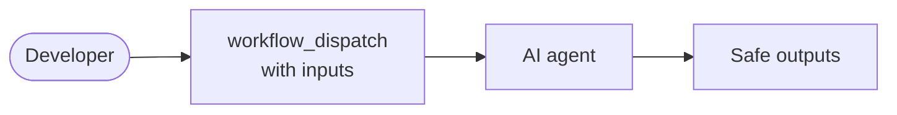

---
title: DispatchOps
description: Manually trigger and test agentic workflows with custom inputs using workflow_dispatch
sidebar:
  badge: { text: 'Manual', variant: 'tip' }
---

DispatchOps is the design pattern where workflows are designed primarily for manual execution via the GitHub Actions UI or CLI. This is used for on-demand tasks, testing, and other workflows that need human judgment about timing. The [`workflow_dispatch` trigger](/gh-aw/reference/triggers/) lets you run workflows with custom inputs whenever needed, with [safe outputs](/gh-aw/reference/safe-outputs/) handling write operations securely.

Use manual dispatch for research tasks, operational commands, testing workflows during development, debugging production issues, or any task that doesn't fit a schedule or event trigger.



## Example: Research Assistant

This example shows a workflow with a string input and a choice input, using conditional logic to adjust behavior at runtime:

```aw wrap
---
on:
  workflow_dispatch:
    inputs:
      topic:
        description: 'Research topic'
        required: true
        type: string
      depth:
        description: 'Analysis depth'
        type: choice
        options:
          - brief
          - detailed
        default: brief

permissions:
  contents: read

safe-outputs:
  create-discussion:
---

# Research Assistant

Research the following topic: "${{ github.event.inputs.topic }}"

{{#if (eq github.event.inputs.depth "detailed")}}
Provide an in-depth analysis: background, key findings, trade-offs, and concrete recommendations with supporting evidence.
{{else}}
Provide a concise summary: top 3 findings and a single recommendation.
{{/if}}
```

Reference inputs with `${{ github.event.inputs.INPUT_NAME }}`. Supported types: `string`, `boolean`, `choice`, `environment`. See [Triggers Reference](/gh-aw/reference/triggers/) for full input syntax and [Templating](/gh-aw/reference/templating/) for conditionals.

## Manually Running Workflows

**From GitHub.com**: Go to the **Actions** tab, select the workflow, click **Run workflow**, fill in inputs, and confirm.

**Via CLI**:

```bash
gh aw run research --raw-field topic="quantum computing" --raw-field depth=detailed
```

```bash
gh aw run research --wait          # Wait for completion
gh aw run research --ref branch    # Run from a specific branch
```

See [CLI Commands](/gh-aw/setup/cli/) for the full `gh aw run` reference.

## Related Documentation

- [Triggers Reference](/gh-aw/reference/triggers/) — Complete `workflow_dispatch` syntax including all input types
- [Templating](/gh-aw/reference/templating/) — Expressions and conditionals in workflow prompts
- [TrialOps](/gh-aw/experimental/trial-ops/) — Testing workflows in isolation
- [CLI Commands](/gh-aw/setup/cli/) — Complete `gh aw run` reference
