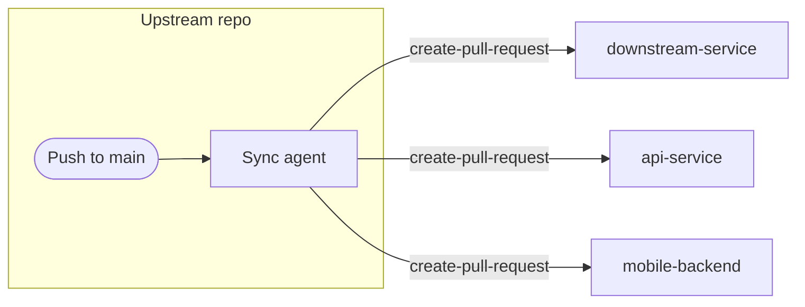

---
title: 'Example: Feature Synchronization'
description: Synchronize features from a main repository to sub-repositories or downstream services with automated pull requests.
sidebar:
  badge: { text: 'Multi-Repo', variant: 'note' }
---

Feature synchronization workflows propagate changes from a main repository to related sub-repositories, ensuring downstream projects stay current with upstream improvements while maintaining proper change tracking through pull requests.

## When to Use

Use feature sync when maintaining related projects in separate repositories (monorepo alternative), propagating library updates to dependent projects, updating platform-specific repos after core changes, or keeping downstream forks synchronized with upstream.

## How It Works



The workflow monitors specific paths in the main repository and creates pull requests in target repositories when changes occur, adapting the changes for each target's structure while maintaining full audit trails.

## Basic Feature Sync

Synchronize changes from shared directory to downstream repository:

```aw wrap
---
on:
  push:
    branches: [main]
    paths:
      - 'shared/**'

permissions:
  contents: read
  actions: read

tools:
  github:
    toolsets: [repos]
  edit:
  bash:
    - "git:*"

safe-outputs:
  github-token: ${{ secrets.GH_AW_CROSS_REPO_PAT }}
  create-pull-request:
    target-repo: "myorg/downstream-service"
    title-prefix: "[sync] "
    labels: [auto-sync, upstream-update]
    reviewers: [team-lead]
    draft: true
---

# Sync Shared Components to Downstream Service

When shared components change, synchronize them to `myorg/downstream-service`. Review the git diff, read current versions from the target repo, adapt paths if needed, and create a PR with descriptive commit messages linking to original commits. Include structural adaptations and migration notes for breaking changes.
```

To sync only specific file types, narrow the `paths` filter — for example `types/**/*.ts` and `interfaces/**/*.ts` to propagate just TypeScript definitions to a client SDK while preserving client-specific extensions.

## Multi-Target Sync

Synchronize to multiple repositories simultaneously:

```aw wrap
---
on:
  push:
    branches: [main]
    paths:
      - 'core/**'

permissions:
  contents: read
  actions: read

tools:
  github:
    toolsets: [repos]
  edit:
  bash:
    - "git:*"

safe-outputs:
  github-token: ${{ secrets.GH_AW_CROSS_REPO_PAT }}
  create-pull-request:
    max: 3
    title-prefix: "[core-sync] "
    labels: [automated-sync]
    draft: true
---

# Sync Core Library to All Services

When core library files change, create PRs in dependent services (`myorg/api-service`, `myorg/web-frontend`, `myorg/mobile-backend`). For each target, check if they use the changed modules, adapt imports/paths, and create a PR with compatibility notes and links to source commits.
```

## Release-Based Sync

Synchronize when new releases are published:

```aw wrap
---
on:
  release:
    types: [published]

permissions:
  contents: read
  actions: read

tools:
  github:
    toolsets: [repos]
  edit:
  bash:
    - "git:*"

safe-outputs:
  github-token: ${{ secrets.GH_AW_CROSS_REPO_PAT }}
  create-pull-request:
    target-repo: "myorg/production-service"
    title-prefix: "[upgrade] "
    labels: [version-upgrade, auto-generated]
    reviewers: [release-manager]
    draft: false
---

# Upgrade Production Service to New Release

When a new release is published (version ${{ github.event.release.tag_name }}), create an upgrade PR that updates version references, applies API changes from release notes, updates configuration for breaking changes, and includes a migration guide with testing recommendations.
```

## Bidirectional Sync with Conflict Detection

Handle bidirectional synchronization with conflict awareness:

```aw wrap
---
on:
  push:
    branches: [main]
    paths:
      - 'shared-config/**'

permissions:
  contents: read
  actions: read

tools:
  github:
    toolsets: [repos, pull_requests]
  edit:
  bash:
    - "git:*"

safe-outputs:
  github-token: ${{ secrets.GH_AW_CROSS_REPO_PAT }}
  create-pull-request:
    target-repo: "myorg/sister-project"
    title-prefix: "[config-sync] "
    labels: [config-update, needs-review]
    draft: true
---

# Bidirectional Config Sync

Synchronize shared configuration between this project and `myorg/sister-project`, which may be modified independently. Compare timestamps and change history; if conflicts are detected, create a PR marked for manual review with conflict notes. If no conflict, apply changes automatically and record sync timestamp.
```

## Other Trigger Variations

The same `create-pull-request` setup works with any trigger. Two common variations:

- **Feature-branch sync** — trigger on `pull_request` for `feature/**` branches (add the `pull_requests` toolset and `pull-requests: read` permission). When a feature branch is updated, create a matching branch in an integration-test repo, sync the relevant changes, update test configurations, and open a PR linking back to the source PR with test scenarios.
- **Scheduled drift check** — trigger on a schedule (`on: weekly on monday`) to catch accumulated changes. Find the last sync PR, identify all commits since then, categorize them (features, fixes, docs), and open a single catch-up PR grouping commits by category with breaking changes highlighted.

## Authentication Setup

Cross-repo sync workflows require authentication via PAT or GitHub App.

### PAT Configuration

Create a PAT with `repo`, `contents: write`, and `pull-requests: write` permissions, then store it as a repository secret:

```bash
gh aw secrets set GH_AW_CROSS_REPO_PAT --value "ghp_your_token_here"
```

### GitHub App Configuration

For enhanced security, use GitHub App installation tokens. See [Using a GitHub App for Authentication](/gh-aw/reference/auth/#using-a-github-app-for-authentication) for complete configuration including repository scoping options.

## Related Documentation

- [MultiRepoOps Design Pattern](/gh-aw/patterns/multi-repo-ops/) - Complete multi-repo overview
- [Cross-Repo Issue Tracking](/gh-aw/examples/multi-repo/issue-tracking/) - Issue management patterns
- [Safe Outputs Reference](/gh-aw/reference/safe-outputs/) - Pull request configuration
- [GitHub Tools](/gh-aw/reference/github-tools/) - Repository access tools
