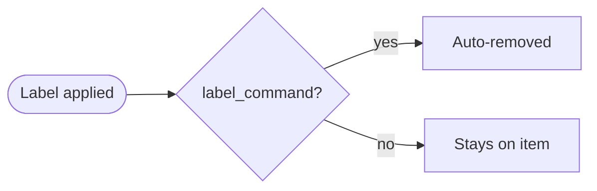
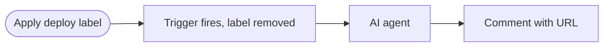

---
title: LabelOps
description: Workflows triggered by label changes - automate actions when specific labels are added or removed
sidebar:
  badge: { text: 'Event-triggered', variant: 'success' }
---

LabelOps uses GitHub labels as workflow triggers, metadata, and state markers. GitHub Agentic Workflows supports two distinct approaches to label-based triggers: [`label_command`](/gh-aw/reference/command-triggers/) for command-style one-shot activation, and [`names:` filtering](/gh-aw/reference/triggers/#filtering-with-labels-names) for persistent label-state awareness.


The `label_command` trigger treats a label as a one-shot command: applying the label fires the workflow, and the label is **automatically removed** so it can be re-applied to re-trigger. This is the right choice when you want a label to mean "do this now" rather than "this item has this property."

## Example: Deploy Preview

This workflow triggers when a `deploy` label is applied to a pull request. It builds and deploys a preview environment, then posts the URL as a comment. The workflow runs with read-only permissions while [safe-outputs](/gh-aw/reference/safe-outputs/) handle the comment creation securely.



Example workflow:

```aw wrap title=".github/workflows/deploy-preview.md"
---
on:
  label_command: deploy

permissions:
  contents: read

safe-outputs:
  add-comment:
    max: 1
---

# Deploy Preview

A `deploy` label was applied to this pull request. Build and deploy a preview environment and post the URL as a comment.

The matched label name is available as `${{ needs.activation.outputs.label_command }}` if needed to distinguish between multiple label commands.
```

After activation the `deploy` label is removed from the pull request, so a reviewer can apply it again to trigger another deployment without any cleanup step.

The label that triggered the workflow is exposed as an output of the activation job:

```
${{ needs.activation.outputs.label_command }}
```

This is useful when a workflow handles multiple label commands and needs to branch on which one was applied.

### Combining with slash commands

`label_command` can be combined with [`slash_command:`](/gh-aw/patterns/chat-ops/) in the same workflow. The two triggers are OR'd — the workflow activates when either condition is met:

```yaml
on:
  slash_command: deploy
  label_command:
    name: deploy
    events: [pull_request]
```

This lets a workflow be triggered both by a `/deploy` comment and by applying a `deploy` label, sharing the same agent logic.

## Label Filtering

Another way to relate workflows to labels is to use [Label Trigger Filtering](/gh-aw/reference/triggers/#filtering-with-labels-names) to ensure that a workflow only runs when a particular label is present on an item.

For example:

```aw wrap
---
on:
  issues:
    types: [labeled]
    names: [bug, critical, security]

permissions:
  contents: read
  actions: read

safe-outputs:
  add-comment:
    max: 1
---

# Critical Issue Handler

When a critical label is added to an issue, analyze the severity and provide immediate triage guidance.

Check the issue for:
- Impact scope and affected users
- Reproduction steps
- Related dependencies or systems
- Recommended priority level

Respond with a comment outlining next steps and recommended actions.
```

In this example, the workflow activates only when the `bug`, `critical`, or `security` labels are added to an issue, not for other label changes. The labels remain on the issue after the workflow runs.

## Applying and Removing Labels

To let an agent apply or remove labels, use the [`add-labels`](/gh-aw/reference/safe-outputs/#add-labels-add-labels) and [`remove-labels`](/gh-aw/reference/safe-outputs/#remove-labels-remove-labels) safe outputs. Use `allowed` to restrict which labels the agent can touch:

```yaml
safe-outputs:
  add-labels:
    allowed: [bug, team-*, area/*]   # restrict to specific labels or glob patterns
  remove-labels:
    allowed: [needs-triage]          # agents can remove triage label after processing
```

Both operations accept glob patterns in `allowed` and `blocked`, and support cross-repository targets via `target-repo`. See the [Add Labels](/gh-aw/reference/safe-outputs/#add-labels-add-labels) and [Remove Labels](/gh-aw/reference/safe-outputs/#remove-labels-remove-labels) reference for the full set of options.

## Related Documentation

- [IssueOps](/gh-aw/patterns/issue-ops/) — Issue-triggered workflows
- [ChatOps](/gh-aw/patterns/chat-ops/) — Slash command automation
- [Trigger Events](/gh-aw/reference/triggers/) — Complete trigger configuration including label filtering
- [Safe Outputs](/gh-aw/reference/safe-outputs/) — Secure write operations
- [Frontmatter Reference](/gh-aw/reference/frontmatter/) — Complete workflow configuration options
