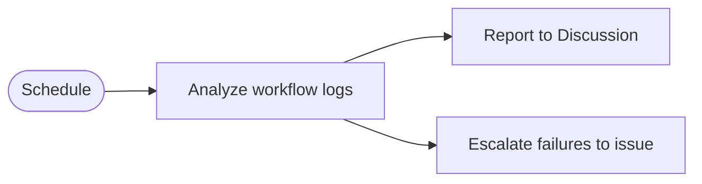

---
title: MonitorOps
description: Monitor agentic workflows across a repository, publish observability reports, and escalate recurring failures or waste.
sidebar:
  badge: { text: 'Observability', variant: 'tip' }
---

Use this pattern when you want a scheduled workflow to inspect other agentic workflows using [workflow logs and auditing](/gh-aw/reference/audit/), summarize what happened, and escalate unusual cost or failure patterns.

The [agentic-ops repository](https://github.com/githubnext/agentic-ops) provides the reference implementation for this approach.

## What this pattern does

This pattern reviews workflow logs across a repository, classifies notable behavior, and publishes a structured report. When it detects repeated failures, abnormal token consumption, or other unhealthy patterns, it can escalate those findings into issues for follow-up.

This pattern is useful for repository-wide monitoring because it creates a durable operational record instead of relying on ad hoc inspection of individual workflow runs.

## Typical workflow

1. Run on a schedule to collect recent workflow activity.
2. Analyze logs, costs, and failure signals across runs.
3. Post a summary report to a GitHub Discussion or another durable destination.
4. Open or update issues when the same problem crosses a threshold.

## When to use it

Use this pattern when a repository has enough workflow activity that maintainers need a regular summary instead of checking each run manually. It also helps when workflows span multiple teams and failures or waste need to be surfaced in a shared location.

## Related Documentation

- [BatchOps](/gh-aw/patterns/batch-ops/) — Process large volumes in parallel chunks
- [Audit Commands](/gh-aw/reference/audit/) — Investigate individual runs and regressions
- [OpenTelemetry](/gh-aw/guides/open-telemetry/) — Workflow telemetry and spans
- [Cache Memory](/gh-aw/reference/cache-memory/) — Persistent state across runs
- [Concurrency](/gh-aw/reference/concurrency/) — Prevent overlapping workflow runs
- [Monitoring with Projects](/gh-aw/experimental/monitoring-with-projects/) — Durable tracking with Projects
