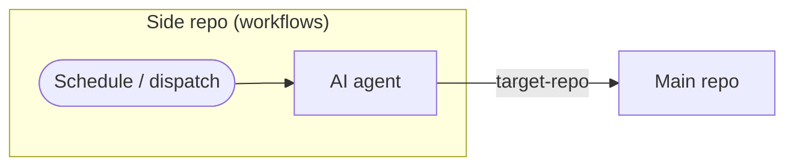
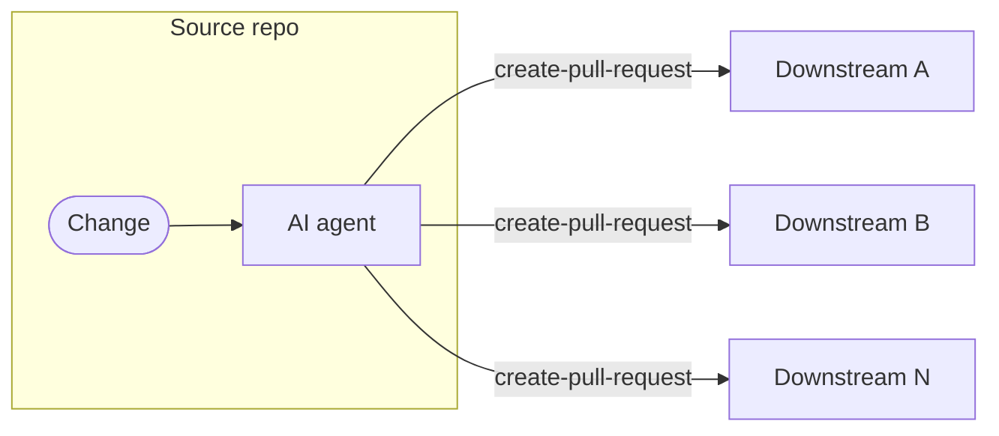

---
title: MultiRepoOps
description: Coordinate agentic workflows across multiple GitHub repositories with automated issue tracking, feature synchronization, and organization-wide enforcement
sidebar:
  badge: { text: 'Advanced', variant: 'caution' }
---

MultiRepoOps extends operational automation patterns (IssueOps, ChatOps, etc.) across multiple GitHub repositories. Using [cross-repository safe outputs](/gh-aw/reference/cross-repository/) and [secure authentication](/gh-aw/reference/auth/), MultiRepoOps enables coordinating work between related projects — creating tracking issues in central repos, synchronizing features to sub-repositories, and enforcing organization-wide policies — all through AI-powered workflows.

## Using a Side Repository

A **side repository** is a dedicated automation repo that runs workflows targeting one or more main codebases. This keeps AI-generated issues, comments, and workflow runs isolated from your main repository — no changes needed to existing projects and no mixing of automation infrastructure with production code.



Teams new to agentic workflows can adopt this pattern: create a private repository, add a PAT as a secret, and point `target-repo` at your main codebase. No changes required to the main repo.

```aw wrap
---
on: weekly on monday

safe-outputs:
  github-token: ${{ secrets.GH_AW_MAIN_REPO_TOKEN }}
  create-issue:
    target-repo: "my-org/main-repo"
    labels: [automation, weekly-check]
    max: 5

tools:
  github:
    github-token: ${{ secrets.GH_AW_MAIN_REPO_TOKEN }}
    toolsets: [repos, issues, pull_requests]
---

# Weekly Repository Health Check

Analyze my-org/main-repo and create issues for stale PRs (>30 days), failed CI runs on main, and open security advisories.
```

Using [Slash commands](/gh-aw/reference/command-triggers/) from a side repo require a bridge: a thin relay workflow in the main repo listens for the command and forwards it via `workflow_dispatch` to the side repo. See [Triage from Side Repo](/gh-aw/examples/multi-repo/triage-from-side-repo/) for a complete walkthrough.

Authentication details and step-by-step setup are covered in the [Triage from Side Repo](/gh-aw/examples/multi-repo/triage-from-side-repo/) and [Code Quality Monitoring](/gh-aw/examples/multi-repo/code-quality-monitoring/) examples, and in the [Authentication reference](/gh-aw/reference/auth/).

## CentralRepoOps

For org-wide rollouts and aggregated tracking across many repositories, see [CentralRepoOps](/gh-aw/patterns/central-repo-ops/). It covers two models: a **central control plane** that dispatches work to target repos, and a **central tracker repo** where component repos push events for unified visibility.

## Flowing Changes to Downstream Repositories

The source repository propagates changes outward to downstream repos whenever relevant paths change. The agent adapts the changes for each target's structure and opens a pull request for review.



Use `max` to control fan-out breadth, and `title-prefix` plus labels to make the automated PRs easy to filter. See [Feature Synchronization](/gh-aw/examples/multi-repo/feature-sync/) for a complete example.

## Cross-Repository Safe Outputs

Most safe output types support `target-repo` to write to external repositories, and `allowed-repos` for dynamic multi-target workflows. See [Cross-Repository Safe Outputs](/gh-aw/reference/cross-repository/#cross-repository-safe-outputs) for the complete list and configuration options, including `target-repo: "*"` for runtime-determined targets and the [GitHub Tools reference](/gh-aw/reference/cross-repository/#cross-repository-reading) for reading from private repositories.

## Deterministic Multi-Repo Workflows

For direct repository access without agent involvement, check out multiple repositories using `checkout:` frontmatter or `actions/checkout` steps. See the [Deterministic Multi-Repo example](/gh-aw/reference/cross-repository/#example-deterministic-multi-repo-workflows) in the cross-repository reference.

## Best Practices

Use GitHub Apps over PATs for automatic token revocation; scope tokens minimally to target repositories. Set appropriate `max` limits and consistent label/prefix conventions. Test against public repositories first before rolling out to private or org-wide targets.

## Related Documentation

- [CentralRepoOps](/gh-aw/patterns/central-repo-ops/) — Central control plane and tracker repo patterns
- [IssueOps](/gh-aw/patterns/issue-ops/) — Single-repo issue automation
- [ChatOps](/gh-aw/patterns/chat-ops/) — Command-driven workflows
- [Cross-Repository Operations](/gh-aw/reference/cross-repository/) — Checkout and `target-repo` configuration
- [Safe Outputs](/gh-aw/reference/safe-outputs/) — Complete safe output configuration
- [GitHub Tools](/gh-aw/reference/github-tools/) — GitHub API toolsets
- [Authentication](/gh-aw/reference/auth/) — PAT and GitHub App setup
- [Reusing Workflows](/gh-aw/guides/reusing-workflows/) — Sharing workflows across repos
