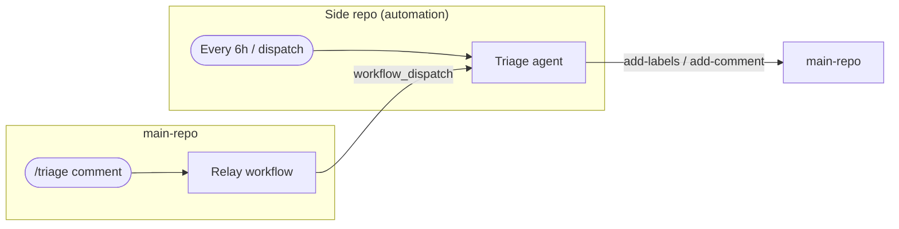

---
title: 'Example: Triage from Side Repo'
description: Run automated issue triage on a main repository from an isolated automation repository, with a slash-command bridge for real-time response.
sidebar:
  badge: { text: 'Multi-Repo', variant: 'note' }
---

This example shows how to run automated triage on `my-org/main-repo` from a dedicated side repository. The side repo hosts all automation workflows; the main repo receives only the resulting labels and comments. A slash-command bridge is included for real-time `/triage` response alongside the scheduled triage run.

## How It Works



- **Scheduled triage** runs every 6 hours from the side repo, finding unlabeled issues and adding appropriate labels and a triage comment.
- **Slash-command triage** is triggered by `/triage` in the main repo. Because GitHub webhooks only fire in the repository where the event occurs, a thin relay workflow in the main repo forwards the command to the side repo via `workflow_dispatch`.

## Setup

### 1. Create the Side Repository

```bash
gh repo create my-org/main-repo-automation --private
gh repo clone my-org/main-repo-automation
cd main-repo-automation
```

### 2. Create the Authentication Token

Create a fine-grained PAT (`GH_AW_MAIN_REPO_TOKEN`) scoped **only to `my-org/main-repo`** with these permissions:

| Permission | Level | Purpose |
|------------|-------|---------|
| Issues | Read & write | Read issues, add labels and comments |
| Contents | Read-only | Read repo structure (for GitHub tools) |

Store it as a secret in the **side repository**:

```bash
gh secret set GH_AW_MAIN_REPO_TOKEN --repo my-org/main-repo-automation
```

> [!NOTE]
> The default `GITHUB_TOKEN` cannot access other repositories. You must use this additional token for both `tools.github` and `safe-outputs`.

For enhanced security, use a [GitHub App token](/gh-aw/reference/auth/#using-a-github-app-for-authentication) instead of a PAT — tokens are minted on demand and automatically revoked after each job.

### 3. Create the Scheduled Triage Workflow

In the side repository, create `.github/workflows/triage.md`:

```aw wrap
---
on: every 6h

permissions:
  contents: read

safe-outputs:
  github-token: ${{ secrets.GH_AW_MAIN_REPO_TOKEN }}
  add-labels:
    target-repo: "my-org/main-repo"
    allowed-labels:
      - bug
      - enhancement
      - question
      - documentation
      - good first issue
      - wontfix
      - duplicate
      - needs-info
  add-comment:
    target-repo: "my-org/main-repo"
    target: "*"

tools:
  github:
    github-token: ${{ secrets.GH_AW_MAIN_REPO_TOKEN }}
    toolsets: [issues]
---

# Triage Main Repository Issues

Find all unlabeled issues in my-org/main-repo opened in the last 7 days.

For each issue:
1. Read the title and body carefully
2. Assign one primary label (bug / enhancement / question / documentation / good first issue)
3. Add a second label if clearly applicable (e.g., duplicate, needs-info, wontfix)
4. Post a brief triage comment explaining the label choice and any suggested next step

Limit to 20 issues per run to avoid rate limits.
```

Compile: `gh aw compile`.

### 4. Create the Slash-Command Bridge

Because webhook events only fire in the repository where they occur, you need two workflows for slash-command support.

**Step 1** — Relay workflow in **`my-org/main-repo`** (`.github/workflows/triage-relay.yml`):

> [!NOTE]
> This is a plain GitHub Actions YAML file, not a compiled agentic workflow. Create it directly as `.yml`.

```yaml
name: Triage relay
on:
  issue_comment:
    types: [created]

jobs:
  relay:
    if: github.event.comment.body == '/triage' && github.event.issue.pull_request == null
    runs-on: ubuntu-latest
    steps:
      - name: Forward to automation repo
        uses: actions/github-script@v7
        with:
          github-token: ${{ secrets.GH_AW_SIDE_REPO_TOKEN }}
          script: |
            await github.rest.actions.createWorkflowDispatch({
              owner: 'my-org',
              repo: 'main-repo-automation',
              workflow_id: 'triage-on-demand.lock.yml',
              ref: 'main',
              inputs: {
                issue_number: String(context.issue.number),
                issue_url: context.payload.issue.html_url,
              }
            });
```

This relay needs a `GH_AW_SIDE_REPO_TOKEN` secret in `main-repo` — a PAT with `Actions: write` on `main-repo-automation`.

**Step 2** — On-demand triage workflow in the **side repo** (`.github/workflows/triage-on-demand.md`):

```aw wrap
---
on:
  workflow_dispatch:
    inputs:
      issue_number:
        description: "Issue number to triage"
        required: true
      issue_url:
        description: "Issue URL for context"
        required: true

permissions:
  contents: read

safe-outputs:
  github-token: ${{ secrets.GH_AW_MAIN_REPO_TOKEN }}
  add-labels:
    target-repo: "my-org/main-repo"
    allowed-labels:
      - bug
      - enhancement
      - question
      - documentation
      - good first issue
      - wontfix
      - duplicate
      - needs-info
  add-comment:
    target-repo: "my-org/main-repo"
    target: "${{ github.event.inputs.issue_number }}"

tools:
  github:
    github-token: ${{ secrets.GH_AW_MAIN_REPO_TOKEN }}
    toolsets: [issues]
---

# Triage Issue on Demand

Triage issue #${{ github.event.inputs.issue_number }} in my-org/main-repo.

Read the issue at ${{ github.event.inputs.issue_url }}, assign the most appropriate label, and post a brief comment explaining the triage decision.
```

Compile: `gh aw compile`.

## Related Documentation

- [MultiRepoOps](/gh-aw/patterns/multi-repo-ops/) — Side repository pattern and other topologies
- [IssueOps](/gh-aw/patterns/issue-ops/) — Event-driven issue automation in the main repo
- [ChatOps](/gh-aw/patterns/chat-ops/) — Slash command workflows
- [Cross-Repository Operations](/gh-aw/reference/cross-repository/) — `target-repo` configuration
- [Authentication](/gh-aw/reference/auth/) — PAT and GitHub App setup
- [Safe Outputs](/gh-aw/reference/safe-outputs/) — Labels, comments, and allowed-labels
