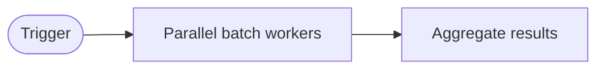
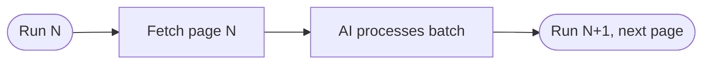
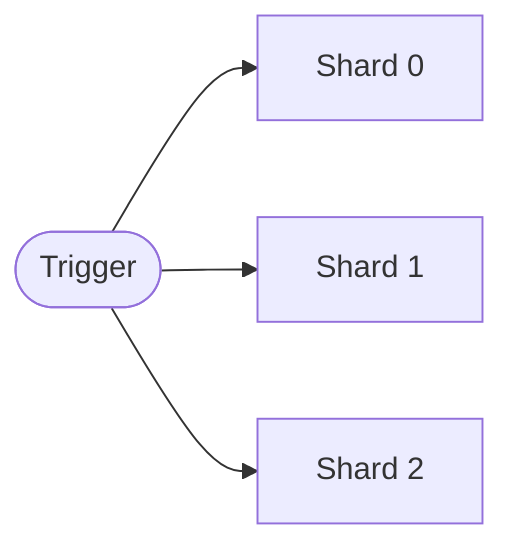
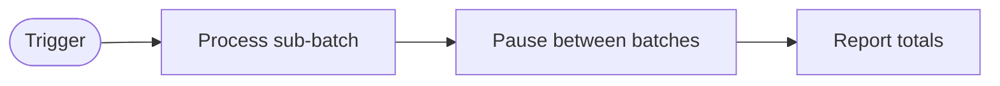

---
title: BatchOps
description: Process large volumes of work in parallel or chunked batches using matrix jobs, rate-limit-aware throttling, and result aggregation
sidebar:
  badge: { text: 'Batch processing', variant: 'caution' }
---

BatchOps is a pattern for processing large volumes of work items efficiently. Instead of iterating sequentially through hundreds of items in a single workflow run, BatchOps splits work into chunks, parallelizes where possible, handles partial failures gracefully, and aggregates results into a consolidated report.



## When to Use BatchOps

| Scenario | Recommendation |
|----------|----------------|
| < 50 items, order matters | Sequential ([WorkQueueOps](/gh-aw/patterns/workqueue-ops/)) |
| 50–500 items, order doesn't matter | BatchOps with chunked processing |
| > 500 items, high parallelism safe | BatchOps with matrix fan-out |
| Items have dependencies on each other | Sequential (WorkQueueOps) |
| Items are fully independent | BatchOps (any strategy) |
| Strict rate limits or quotas | Rate-limit-aware batching |

## Batch Strategy 1: Chunked Processing

Split work into fixed-size pages using `GITHUB_RUN_NUMBER`. Each run processes one page, picking up the next slice on the next scheduled run. Items must have a stable sort key (creation date, issue number) so pagination is deterministic.



Example workflow:

```aw wrap title=".github/workflows/stale-processor.md"
---
on:
  schedule: daily on weekdays
  workflow_dispatch:

tools:
  github:
    toolsets: [issues]
  bash:
    - "jq"
    - "date"

safe-outputs:
  add-labels:
    allowed: [stale, needs-triage, archived]
    max: 30
  add-comment:
    max: 30

steps:
  - name: compute-page
    id: compute-page
    run: |
      PAGE_SIZE=25
      # Use run number mod to cycle through pages; reset every 1000 runs
      PAGE=$(( (GITHUB_RUN_NUMBER % 1000) * PAGE_SIZE ))
      echo "page_offset=$PAGE" >> "$GITHUB_OUTPUT"
      echo "page_size=$PAGE_SIZE" >> "$GITHUB_OUTPUT"
---

# Chunked Issue Processor

This run covers offset ${{ steps.compute-page.outputs.page_offset }} with page size ${{ steps.compute-page.outputs.page_size }}.

1. List issues sorted by creation date (oldest first), skipping the first ${{ steps.compute-page.outputs.page_offset }} and taking ${{ steps.compute-page.outputs.page_size }}.
2. For each issue: add `stale` if last updated > 90 days ago with no recent comments; add `needs-triage` if it has no labels; post a stale warning comment if applicable.
3. Summarize: issues labeled, comments posted, any errors.
```

## Batch Strategy 2: Fan-Out with Matrix

Use GitHub Actions matrix to run multiple batch workers in parallel, each responsible for a non-overlapping shard. Use `fail-fast: false` so one shard failure doesn't cancel the others. Each shard gets its own token and API rate limit quota.



Example workflow:

```aw wrap title=".github/workflows/batch-worker.md"
---
on:
  workflow_dispatch:
    inputs:
      total_shards:
        description: "Number of parallel workers"
        default: "4"
        required: false

jobs:
  batch:
    strategy:
      matrix:
        shard: [0, 1, 2, 3]
      fail-fast: false   # Continue other shards even if one fails

tools:
  github:
    toolsets: [issues, pull_requests]

safe-outputs:
  add-labels:
    allowed: [reviewed, duplicate, wontfix]
    max: 50
---

# Matrix Batch Worker — Shard ${{ matrix.shard }} of ${{ inputs.total_shards }}

Process only issues where `(issue_number % ${{ inputs.total_shards }}) == ${{ matrix.shard }}` — this ensures no two shards process the same issue.

1. List all open issues (up to 500) and keep only those assigned to this shard.
2. For each issue: check for duplicates (similar title/content); add label `reviewed`; if a duplicate is found, add `duplicate` and reference the original.
3. Report: issues in this shard, how many labeled, any failures.
```

## Batch Strategy 3: Rate-Limit-Aware Batching

Throttle API calls by processing items in small sub-batches with explicit pauses. Slower than unbounded processing but dramatically reduces rate-limit errors. Use [Rate Limiting Controls](/gh-aw/reference/rate-limiting-controls/) for built-in throttling.



Example workflow:

```aw wrap title=".github/workflows/rate-limited-batch.md"
---
on:
  workflow_dispatch:
    inputs:
      batch_size:
        description: "Items per sub-batch"
        default: "10"
      pause_seconds:
        description: "Seconds to pause between sub-batches"
        default: "30"

tools:
  github:
    toolsets: [repos, issues]
  bash:
    - "sleep"
    - "jq"

safe-outputs:
  add-comment:
    max: 100
  add-labels:
    allowed: [labeled-by-bot]
    max: 100
---

# Rate-Limited Batch Processor

Process all open issues in sub-batches of ${{ inputs.batch_size }}, pausing ${{ inputs.pause_seconds }} seconds between batches.

1. Fetch all open issue numbers (paginate if needed).
2. For each sub-batch: read each issue body, determine the correct label, add the label, then pause before the next sub-batch.
3. On HTTP 429: pause 60 seconds and retry once before marking the item as failed.
4. Report: total processed, failed, skipped.
```

## Batch Strategy 4: Result Aggregation

Collect results from multiple batch workers or runs and aggregate them into a single summary issue. Use [cache-memory](/gh-aw/reference/cache-memory/) to store intermediate results when runs span multiple days.


Example workflow:

```aw wrap title=".github/workflows/batch-aggregator.md"
---
on:
  workflow_dispatch:
    inputs:
      report_issue:
        description: "Issue number to aggregate results into"
        required: true

tools:
  cache-memory: true
  github:
    toolsets: [issues, repos]
  bash:
    - "jq"

safe-outputs:
  add-comment:
    max: 1
  update-issue:
    body: true

steps:
  - name: collect-results
    run: |
      # Aggregate results from all result files written by previous batch runs
      RESULTS_DIR="/tmp/gh-aw/cache-memory/batch-results"
      if [ -d "$RESULTS_DIR" ]; then
        jq -s '
          {
            total_processed: (map(.processed) | add // 0),
            total_failed: (map(.failed) | add // 0),
            total_skipped: (map(.skipped) | add // 0),
            runs: length,
            errors: (map(.errors // []) | add // [])
          }
        ' "$RESULTS_DIR"/*.json > /tmp/gh-aw/cache-memory/aggregate.json
        cat /tmp/gh-aw/cache-memory/aggregate.json
      else
        echo '{"total_processed":0,"total_failed":0,"total_skipped":0,"runs":0,"errors":[]}' \
          > /tmp/gh-aw/cache-memory/aggregate.json
      fi
---

# Batch Result Aggregator

Aggregate results from previous batch runs stored in `/tmp/gh-aw/cache-memory/batch-results/` into issue #${{ inputs.report_issue }}.

1. Read `/tmp/gh-aw/cache-memory/aggregate.json` for totals and each individual result file for per-run breakdowns.
2. Update issue #${{ inputs.report_issue }} body with a Markdown table: summary row (processed/failed/skipped) plus per-run breakdown. List any errors requiring manual intervention.
3. Add a comment: "Batch complete ✅" if no failures, or "Batch complete with failures ⚠️" with a list of failed items.
4. For each failed item, create a sub-issue so it can be retried.
```

## Related Documentation

- [WorkQueueOps](/gh-aw/patterns/workqueue-ops/) — Sequential queue processing with issue checklists, sub-issues, cache-memory, and Discussions
- [ResearchPlanAssignOps](/gh-aw/patterns/research-plan-assign-ops/) — Research → Plan → Assign for developer-supervised work
- [Cache Memory](/gh-aw/reference/cache-memory/) — Persistent state storage across workflow runs
- [Repo Memory](/gh-aw/reference/repo-memory/) — Git-committed persistent state
- [Rate Limiting Controls](/gh-aw/reference/rate-limiting-controls/) — Built-in throttling for API-heavy workflows
- [Concurrency](/gh-aw/reference/concurrency/) — Prevent overlapping batch runs
