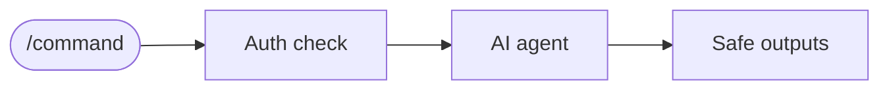

---
title: ChatOps
description: Interactive automation triggered by slash commands (/review, /deploy) in issues and PRs - human-in-the-loop workflows
sidebar:
  badge: { text: 'Command-triggered', variant: 'note' }
---

ChatOps brings automation into GitHub conversations through [command triggers](/gh-aw/reference/command-triggers/) that respond to slash commands in issues, pull requests, and comments. Team members can trigger workflows by typing commands like `/review` or `/deploy` directly in discussions.



By default, only users with write permissions can trigger ChatOps commands. Narrow or widen that with `on.roles:` — see [Repository Access Roles](/gh-aw/reference/triggers/#filtering-by-repository-access-roles-onroles-onskip-roles).

## Example: Code Reviewer

In the following example, when someone types `/review`, the AI analyzes code changes and posts review comments. The agent runs with read-only permissions while [safe-outputs](/gh-aw/reference/safe-outputs/) (validated GitHub operations) handle write operations securely.

The example uses `events:` to restrict which comment contexts activate a command — in this case `[pull_request_comment]` to respond only in PR threads. See [Filtering Command Events](/gh-aw/reference/command-triggers/#filtering-command-events).

The example also references the triggering content via `steps.sanitized.outputs.text`, which strips injection attempts, excessive content, and untrusted mentions — see [Context Text](/gh-aw/reference/command-triggers/#context-text).

```aw wrap
---
on:
  slash_command:
    name: review
    events: [pull_request_comment]  # Only respond to /review in PR comments

permissions:
  contents: read
  pull-requests: read

safe-outputs:
  create-pull-request-review-comment:
    max: 5
  add-comment:
---

# Code Review Assistant

When someone types /review in a pull request comment, perform a thorough analysis of the changes.

Examine the diff for potential bugs, security vulnerabilities, performance implications, code style issues, and missing tests or documentation.

Create specific review comments on relevant lines of code and add a summary comment with overall observations and recommendations.
```

## Related Documentation

- [IssueOps](/gh-aw/patterns/issue-ops/) — Event-driven issue automation
- [DispatchOps](/gh-aw/patterns/dispatch-ops/) — Manual workflow triggers
- [LabelOps](/gh-aw/patterns/label-ops/) — Label-triggered automation
- [MultiRepoOps — Side Repository](/gh-aw/patterns/multi-repo-ops/#using-a-side-repository) — Isolated workflow execution
- [Command Triggers](/gh-aw/reference/command-triggers/) — Slash command configuration
- [Safe Outputs](/gh-aw/reference/safe-outputs/) — Secure write operations
- [Authentication](/gh-aw/reference/auth/) — PAT and GitHub App setup