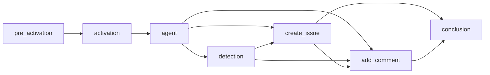
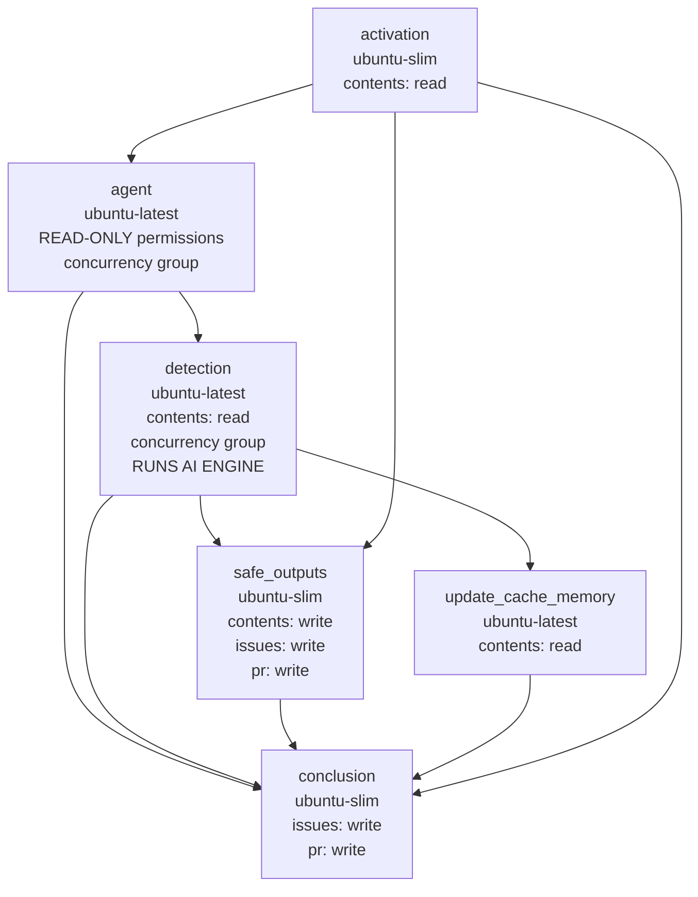

---
title: Compilation Process
description: Advanced technical documentation on how GitHub Agentic Workflows compiles markdown files into GitHub Actions YAML, including job orchestration, action pinning, artifacts, and MCP integration.
sidebar:
  order: 999
---

This guide documents the internal compilation process that transforms markdown workflow files into executable GitHub Actions YAML. Understanding this process helps when debugging workflows, optimizing performance, or contributing to the project.

## Overview

The `gh aw compile` command transforms a markdown workflow file into a complete GitHub Actions `.lock.yml` by embedding frontmatter and setting up runtime loading of the markdown body. The process runs five compilation phases (parsing, validation, job construction, dependency resolution, and YAML generation) described below.

When the workflow runs, the markdown body is loaded at runtime — you can edit instructions without recompilation. See [Editing Workflows](/gh-aw/guides/editing-workflows/) for details.

## Compilation Phases

### Phase 1: Parsing and Validation

The compiler extracts the YAML frontmatter, validates it against the workflow schema, validates expression safety (only allow-listed GitHub Actions expressions), and resolves imports.

#### Import Resolution

Imports are resolved with a deterministic breadth-first traversal: starting from `imports:` in the main workflow, each file is loaded, its configurations are extracted, and any nested imports are appended to the queue. Visited files are tracked to detect cycles.

| Field | Merge strategy |
|-------|----------------|
| Tools | Deep merge; arrays concatenated and deduplicated |
| MCP servers | Imported servers override main-workflow servers with the same name |
| Network | Union of allowed domains, deduplicated and sorted |
| Permissions | Validation only — main must satisfy imported requirements |
| Safe outputs | Main workflow overrides imported configurations per type |
| Runtimes | Main workflow versions override imported versions |

Processing order follows BFS:

```
Main Workflow
├── import-a.md          → Processed 1st
│   ├── nested-1.md      → Processed 3rd (after import-b)
│   └── nested-2.md      → Processed 4th
└── import-b.md          → Processed 2nd
    └── nested-3.md      → Processed 5th
```

See [Imports Reference](/gh-aw/reference/imports/) for complete merge semantics.

### Phases 2–5: Building the Workflow

| Phase | Steps |
|-------|-------|
| **2 Job Construction** | Builds specialized jobs: pre-activation (if needed), activation, agent, safe outputs, safe-jobs, and custom jobs |
| **3 Dependency Resolution** | Validates job dependencies, detects circular references, computes topological order, generates Mermaid graph |
| **4 Action Pinning** | Pins all actions to SHAs: check cache → GitHub API → embedded pins → add version comment (e.g., `actions/checkout@sha # v6`) |
| **5 YAML Generation** | Assembles final `.lock.yml`: header with metadata, Mermaid dependency graph, alphabetical jobs, embedded original prompt |

## Job Types

The compilation process generates specialized jobs based on workflow configuration:

| Job | Trigger | Purpose | Key Dependencies |
|-----|---------|---------|------------------|
| **pre_activation** | Role checks, stop-after deadlines, skip-if-match, or command triggers | Validates permissions, deadlines, and conditions before AI execution | None (runs first) |
| **activation** | Always | Prepares workflow context, sanitizes event text, validates lock file freshness | `pre_activation` (if exists) |
| **agent** | Always | Core job that executes AI agent with configured engine, tools, and Model Context Protocol (MCP) servers | `activation` |
| **detection** | `safe-outputs.threat-detection:` configured | Scans agent output for security threats before processing | `agent` |
| **Safe output jobs** | Corresponding `safe-outputs.*:` configured | Process agent output to perform GitHub API operations (create issues/PRs, add comments, upload assets, etc.) | `agent`, `detection` (if exists) |
| **conclusion** | Always (if safe outputs exist) | Aggregates results and generates workflow summary | All safe output jobs |

### Agent Job Steps

The agent job runs: repository checkout and runtime setup (Node.js, Python, Go) → cache restoration → MCP container initialization → prompt generation from the markdown body → engine execution (Copilot, Claude, or Codex) → output upload as a GitHub Actions artifact → cache persistence. Key environment variables: `GH_AW_PROMPT` (prompt file), `GH_AW_SAFE_OUTPUTS` (output JSON), `GITHUB_TOKEN`.

### Safe Output Jobs

Every safe output job follows the same pattern: download the agent artifact, parse its JSON, execute the corresponding GitHub API operation with the right permissions, and link to related items. Available types include `create_issue`, `create_discussion`, `add_comment`, `create_pull_request`, `create_pr_review_comment`, `create_code_scanning_alert`, `add_labels`, `assign_milestone`, `update_issue`, `update_release`, `push_to_pr_branch`, `upload_assets`, `update_project`, `missing_tool`, and `noop`.

### Custom Jobs

Use `safe-outputs.jobs:` for custom jobs with full GitHub Actions syntax, or `jobs:` for additional workflow jobs with user-defined dependencies. See [DeterministicOps](/gh-aw/patterns/deterministic-ops/) for examples of multi-stage workflows combining deterministic computation with AI reasoning.

## Job Dependency Graphs

Jobs execute in topological order based on dependencies. Here's a comprehensive example:



**Execution flow**: Pre-activation validates permissions → Activation prepares context → Agent executes AI → Detection scans output → Safe outputs run in parallel → Add comment waits for created items → Conclusion summarizes results. Safe output jobs without cross-dependencies run concurrently; when threat detection is enabled, safe outputs depend on both agent and detection jobs.

## Why Detection, Safe Outputs, and Conclusion Are Separate Jobs

A typical compiled workflow contains these post-agent jobs:



These three jobs form a **sequential security pipeline** rooted in [Plan-Level Trust](/gh-aw/introduction/architecture/) — AI reasoning (read-only) is separated from write operations. They cannot be merged because GitHub Actions permissions are per-job and immutable for the duration of a job:

| Job | Key Permissions | Rationale |
|-----|----------------|-----------|
| **detection** | `contents: read` | Runs AI analysis — must not have write access |
| **safe_outputs** | `contents: write`, `issues: write`, `pull-requests: write` | Executes GitHub API write operations |
| **conclusion** | `issues: write`, `pull-requests: write`, `discussions: write` | Updates comments, handles failures |

A combined job would hold write permissions while running threat detection, defeating least privilege and letting a compromised agent bypass the gate. Job-level isolation also enables:

- **Hard gating.** The `safe_outputs` job condition `needs.detection.outputs.success == 'true'` prevents the runner from starting at all if detection fails. Step-level `if` checks within one job are weaker.
- **`always()` semantics for `conclusion`.** It inspects upstream results via `needs.agent.result` to log errors and report missing tools even when writes fail.
- **Right-sized runners.** Detection needs `ubuntu-latest` for AI execution; safe_outputs and conclusion use the lightweight `ubuntu-slim`.
- **Concurrency isolation.** Detection shares a concurrency group with the agent job to serialize AI execution; safe_outputs intentionally does not, so it can run alongside other workflows' detection phases.
- **Artifact-based handoff.** The agent writes `agent_output.json`; detection emits `success`; safe_outputs only downloads the artifact if approved. A shared filesystem in a single job would allow output tampering between phases.

## Action Pinning

All GitHub Actions are pinned to commit SHAs (e.g., `actions/checkout@b4ffde6...11 # v6`) to defend against supply chain attacks — tags can be moved, SHAs cannot. Resolution order is cache (`.github/aw/actions-lock.json`) → GitHub API → embedded pins.

### The actions-lock.json Cache

`.github/aw/actions-lock.json` caches resolved `action@version` → SHA mappings so compilation produces consistent results regardless of the available token. Resolving a tag to a SHA requires GitHub API access, which fails under restricted tokens — notably the GitHub Copilot Coding Agent (CCA) token. With the cache, CCA and similar restricted environments reuse SHAs from a prior compile run with a broader-scope token.

**Commit `actions-lock.json` to version control** so every contributor and automated tool uses the same immutable pins. Refresh with `gh aw update-actions`, or delete and recompile with a permissive token to force full re-resolution.

## The gh-aw-actions Repository

`github/gh-aw-actions` contains the reusable actions that power compiled workflows. Every action step in a generated `.lock.yml` references it (usually by commit SHA, occasionally by a stable tag like `v0` when SHA resolution is unavailable):

```yaml
uses: github/gh-aw-actions/setup@abc1234...
```

Never edit these references by hand — run `gh aw compile` or `gh aw update-actions` to regenerate them. Use `--actions-repo` (with `--action-mode action`) to compile against a fork or specific tag during development; see [Compilation Commands](#compilation-commands).

### Dependabot and gh-aw-actions

Dependabot may open PRs to bump `github/gh-aw-actions` to a newer SHA. **Do not merge them** — pin updates must come from `gh aw compile`, which coordinates pins across all compiled workflows from a single release. `gh aw compile` automatically inserts an ignore rule when a `github-actions` update block exists in `.github/dependabot.yml`. When enabling Dependabot from scratch, use:

```yaml
updates:
  - package-ecosystem: github-actions
    directory: "/.github/workflows"
    ignore:
      - dependency-name: "github/gh-aw-actions" # Managed by gh aw compile. Version-locked to the gh-aw compiler; do not bump.
```

## Artifacts Created

Workflows generate several artifacts during execution:

| Artifact | Location | Purpose | Lifecycle |
|----------|----------|---------|-----------|
| **agent_output.json** | `/tmp/gh-aw/safeoutputs/` | AI agent output with structured safe output data (create_issue, add_comment, etc.) | Uploaded by agent job, downloaded by safe output jobs, auto-deleted after 90 days |
| **agent_usage.json** | `/tmp/gh-aw/` | Aggregated token counts: `{"input_tokens":…,"output_tokens":…,"cache_read_tokens":…,"cache_write_tokens":…}` | Bundled in the unified agent artifact when the firewall is enabled; accessible to third-party tools without parsing step summaries |
| **prompt.txt** | `/tmp/gh-aw/aw-prompts/` | Generated prompt sent to AI agent (includes markdown instructions, imports, context variables) | Retained for debugging and reproduction |
| **firewall-audit-logs** | See structure below | Dedicated artifact for AWF audit/observability logs (token usage, network policy, audit trail) | Uploaded by all firewall-enabled workflows; analyzed by `gh aw logs --artifacts firewall` |
| **firewall-logs/** | `/tmp/gh-aw/sandbox/firewall/logs/` | Network access logs in Squid format (when `network.firewall:` enabled) | Analyzed by `gh aw logs` command |
| **cache-memory/** | `/tmp/gh-aw/cache-memory/` | Persistent agent memory across runs (when `tools.cache-memory:` configured) | Restored at start, saved at end via GitHub Actions cache |
| **patches/**, **sarif/**, **metadata/** | Various | Safe output data (git patches, SARIF files, metadata JSON) | Temporary, cleaned after processing |

### `firewall-audit-logs` Artifact Structure

The `firewall-audit-logs` artifact is a dedicated multi-file artifact uploaded by all firewall-enabled workflows. It is **separate** from the unified `agent` artifact. Downstream workflows that need token usage data or firewall audit logs must download this artifact specifically.

```
firewall-audit-logs/
├── api-proxy-logs/
│   ├── token-usage.jsonl        ← Token usage data per request
│   └── token-diag.log           ← Token diagnostics JSONL (only when AWF_DEBUG_TOKENS=1)
├── squid-logs/
│   └── access.log               ← Network policy log (allow/deny)
├── audit.jsonl                  ← Firewall audit trail
└── policy-manifest.json         ← Policy configuration snapshot
```

`token-diag.log` is optional debug output from the AWF api-proxy token persistence diagnostics (`diag()` in `containers/api-proxy/token-persistence.js`). The file is only written when `AWF_DEBUG_TOKENS=1`, so that variable must be set on the workflow step that runs with AWF enabled when token diagnostics are needed.

> **Tip:** Use `gh aw logs <run-id> --artifacts firewall` to download and analyze firewall data instead of `gh run download` directly. The CLI handles artifact naming and backward compatibility automatically. See the [Artifacts reference](/gh-aw/reference/artifacts/) for the complete artifact naming guide.

## MCP Server Integration

Model Context Protocol (MCP) servers provide tools to AI agents. Compilation emits `mcp-config.json` from the workflow's tool configuration. Local servers run in Docker containers with auto-generated Dockerfiles and connect via stdio; HTTP servers connect directly with configured headers and authentication. `allowed:` restricts which tools the agent sees, and secrets inject through Dockerfile env vars (local) or config references (HTTP). At runtime, MCP containers start after runtime setup, the engine executes with tool access, then containers stop.

## Pre-Activation Job

Pre-activation runs gating checks sequentially before any AI execution. Any failure sets `activated=false`, skipping downstream jobs and saving costs:

- **Role checks** (`roles:`) — actor's role exactly matches one of the entries in the allowlist (default `[admin, maintainer, write]`; no privilege hierarchy — `roles: [write]` rejects `admin` and `maintainer` actors)
- **Stop-after** (`on.stop-after:`) — workflow has not passed its deadline (e.g., `+30d`, `2024-12-31`)
- **Skip-if-match** (`skip-if-match:`) — no existing item matches the dedup criteria
- **Command position** (`on.slash_command:`) — slash command appears in the first 3 lines

## Compilation Commands

| Command | Description |
|---------|-------------|
| `gh aw compile` | Compile all workflows in `.github/workflows/` |
| `gh aw compile my-workflow` | Compile specific workflow |
| `gh aw compile --verbose` | Enable verbose output |
| `gh aw compile --strict` | Enhanced security validation |
| `gh aw compile --no-emit` | Validate without generating files |
| `gh aw compile --actionlint --zizmor --poutine` | Run security scanners |
| `gh aw compile --purge` | Remove orphaned `.lock.yml` files |
| `gh aw compile --output /path/to/output` | Custom output directory |
| `gh aw compile --action-mode action --actions-repo owner/repo` | Compile using a custom actions repository (requires `--action-mode action`) |
| `gh aw compile --action-mode action --actions-repo owner/repo --action-tag branch-or-sha` | Compile against a specific branch or SHA in a fork |
| `gh aw compile --action-tag v1.2.3` | Pin action references to a specific tag or SHA (implies release mode) |
| `gh aw validate` | Validate all workflows (compile + all linters, no file output) |
| `gh aw validate my-workflow` | Validate a specific workflow |
| `gh aw validate --json` | Validate and output results in JSON format |
| `gh aw validate --strict` | Validate with strict mode enforced |

> [!TIP]
> Compilation is only required when changing **frontmatter configuration**. The **markdown body** (AI instructions) is loaded at runtime and can be edited without recompilation. See [Editing Workflows](/gh-aw/guides/editing-workflows/) for details.

> [!NOTE]
> The `--actions-repo` flag overrides the default `github/gh-aw-actions` repository used when `--action-mode action` is set. Use it together with `--action-tag` to compile against a branch or fork during development.

## Debugging Compilation

Run `DEBUG=workflow:* gh aw compile my-workflow --verbose` to trace job creation, action pin resolution, tool configuration, and MCP setup. Inspect generated `.lock.yml` files for header comments, the Mermaid dependency graph, job structure, SHA pins, and MCP config. Common fixes: circular dependencies → review `needs:` clauses; missing action pin → add to `action_pins.json` or enable dynamic resolution; invalid MCP config → verify `command`, `args`, `env`.

## Performance

Simple workflows compile in ~100ms; workflows with imports in ~500ms; workflows that resolve action SHAs dynamically in ~2s. To keep compilation fast, commit `.github/aw/actions-lock.json` and minimize import depth. At runtime, safe output jobs without cross-dependencies run in parallel; enable `cache:` and `cache-memory:` for further speedups.

## Advanced Topics

- **Custom engines**: implement an engine that returns GitHub Actions steps and tool access, then register it with the framework.
- **Schema extension**: add frontmatter fields by updating the workflow schema, rebuilding (`make build`), and wiring up parser handling.
- **Workflow manifest**: imported files are tracked in lock file headers for update detection and audit trails.

## Related Documentation

- [Editing Workflows](/gh-aw/guides/editing-workflows/) - When to recompile vs edit directly
- [Frontmatter Reference](/gh-aw/reference/frontmatter/) - All configuration options
- [Tools Reference](/gh-aw/reference/tools/) - Tool configuration guide
- [Safe Outputs Reference](/gh-aw/reference/safe-outputs/) - Output processing
- [Engines Reference](/gh-aw/reference/engines/) - AI engine configuration
- [Network Reference](/gh-aw/reference/network/) - Network permissions
