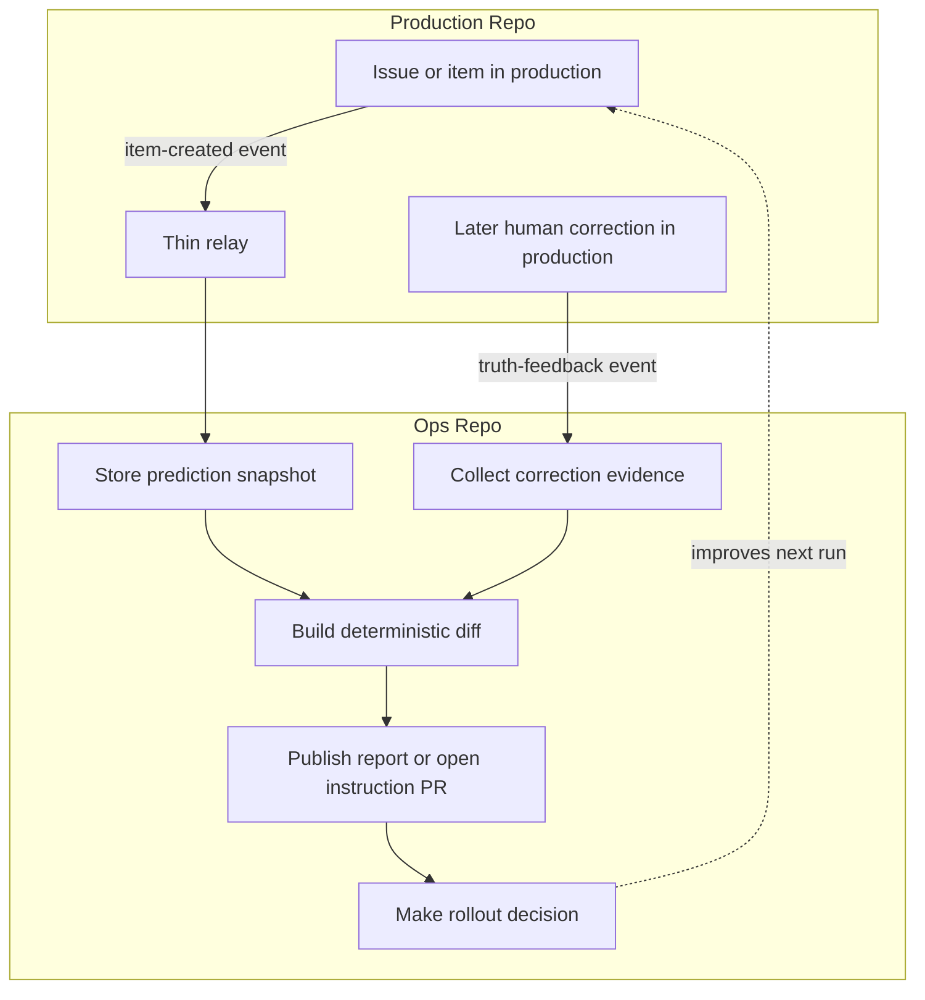

---
title: CorrectionOps
description: Improve agentic workflows from trusted human corrections without retraining the underlying model
---

:::caution[Experimental]
CorrectionOps is an experimental pattern. The guidance and workflow shape on this page may change as the pattern is tested in more real-world workflows.
:::

CorrectionOps improves the workflow *around* the model rather than retraining it. It stores predictions at decision time, compares them with later trusted human truth, and uses that evidence to update instructions, routing, thresholds, and rollout decisions.

The basic loop: save what the workflow predicted, collect what humans later decided, and use the difference to improve the workflow.

## When to Use CorrectionOps

Use CorrectionOps when humans still make or correct the real decision and you want the workflow to improve iteratively. Typical fits: labeling and classification, routing and prioritization, moderation and approvals, and summaries or recommendations that humans later correct. It is especially useful when the rollout path is gradual — start with `staged: true`, keep evaluation in Ops, and promote to direct writes only once evidence is strong enough.

## How It Works

A clean CorrectionOps setup has two long-lived surfaces. Production stays authoritative. Ops hosts prediction, correction intake, reporting, instruction updates, and rollout control — initially without writing back to production, later with direct writes once promoted.

Most implementations need three workflow classes: a thin relay forwarding stable facts into ops, a prediction workflow that persists snapshots, and a compare/report/decide workflow that checks human truth and updates the system. Keep relays, diffing, and grouping deterministic; use the agent for semantic judgment only.

## Example: Issue Labeling



A single CorrectionOps worker can carry the pattern when permissions and triggers fit cleanly:

```aw wrap
---
on:
  schedule: daily
  workflow_dispatch:
  repository_dispatch:
    types: [truth-feedback]

permissions:
  contents: read
  issues: read

safe-outputs:
  create-issue:
  create-pull-request:
---

# CorrectionOps Worker

Read persisted predictions and later trusted truth, compare them deterministically, then either publish a health report or open a draft PR updating instructions.
```

Unlike RLHF, which updates model weights, CorrectionOps changes instructions and rollout state — no separate evaluation repository required.

### Full Workflow Pieces

#### 1. Relay In The Source Repo

Forwards stable facts and provenance into ops — no diffs, no intent inference, no correctness decisions.

```yaml title="prod-repo/.github/workflows/relay-correction-signals.yml"
name: Relay Correction Signals

on:
  issues:
    types: [opened, labeled, unlabeled]

jobs:
  relay:
    runs-on: ubuntu-latest
    steps:
      - name: Forward stable facts to ops
        uses: actions/github-script@v8
        with:
          github-token: ${{ secrets.OPS_DISPATCH_TOKEN }}
          script: |
            await github.rest.repos.createDispatchEvent({
              owner: 'org',
              repo: 'ops-repo',
              event_type: context.payload.action === 'opened' ? 'item-created' : 'truth-feedback',
              client_payload: {
                data: {
                  source_repository: `${context.repo.owner}/${context.repo.repo}`,
                  source_type: 'issue',
                  item_number: context.payload.issue.number,
                  item_title: context.payload.issue.title,
                  item_url: context.payload.issue.html_url,
                  event_type: context.payload.action,
                  label: context.payload.label?.name || null,
                  actor: context.actor,
                  actor_type: context.actor.endsWith('[bot]') ? 'bot' : 'human',
                  occurred_at: new Date().toISOString(),
                },
              },
            });
```

#### 2. Prediction Workflow In Ops

Applies the current instructions to normalized inputs and persists a durable prediction snapshot.

```aw wrap title="ops-repo/.github/workflows/predict-items.md"
---
name: Predict Items

on:
  schedule: daily
  workflow_dispatch:
  repository_dispatch:
    types: [item-created]

tools:
  github:
    toolsets: [issues, repos]

safe-outputs:
  create-issue:
  update-issue:
---

# Predict Items

Read prepared items from `/tmp/gh-aw/agent/item-scan`, apply current instructions, write review artifacts via safe outputs, and append a prediction snapshot (source identifier, predicted action, instruction version, timestamp).
```

#### 3. Compare, Report, And Decide In Ops

Builds deterministic diffs from predictions and later human truth, then asks the agent to summarize patterns or propose instruction updates.

```aw wrap title="ops-repo/.github/workflows/review-corrections.md"
---
name: Review Corrections

on:
  schedule: weekly
  workflow_dispatch:
    inputs:
      mode:
        description: report or adaptation
        required: false
        default: report
        type: choice
        options: [report, adaptation]

safe-outputs:
  create-issue:
  create-pull-request:
---

# Review Corrections

Read `correction-diffs.json` from `/tmp/gh-aw/agent/correction-review`. In `report` mode, publish a health summary. In `adaptation` mode, open a draft PR updating the instruction file only when the grouped evidence is strong enough.
```

#### 4. Optional Deterministic Collector

Add a separate collector when the later-truth boundary needs its own trigger, permissions, or write path.

```yaml title="ops-repo/.github/workflows/collect-corrections.yml"
name: Collect Corrections

on:
  repository_dispatch:
    types: [truth-feedback]

jobs:
  collect:
    runs-on: ubuntu-latest
    steps:
      - name: Resolve authoritative truth and store correction evidence
        run: ./scripts/store-correction-evidence.sh
```

### Stable Contracts To Define First

Before adding rollout logic or adaptation prompts, define four deterministic contracts:

1. **relay payload**: minimal source/object identity, event type, actor facts, and timestamps forwarded into ops
2. **prediction snapshot**: durable record of the prediction and the instruction version that produced it
3. **correction review input**: deterministic diff artifact consumed by reporting and adaptation
4. **rollout gate contract**: evidence or approvals required before direct production writes are enabled

## Related Documentation

- [Staged Mode](/gh-aw/reference/staged-mode/) — safe-write rollout guidance for CorrectionOps
- [MultiRepoOps](/gh-aw/patterns/multi-repo-ops/) — separating workflow infrastructure from production across repositories
- [Safe Outputs Reference](/gh-aw/reference/safe-outputs/) — controlling write targets and protections
- [GitHub Tools](/gh-aw/reference/github-tools/) — cross-repository reads and operations
