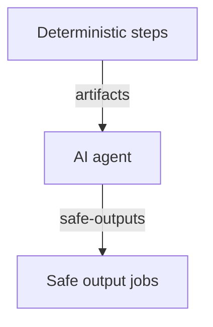

---
title: DeterministicOps
description: Combine deterministic computation and data extraction with agentic reasoning in GitHub Agentic Workflows for powerful hybrid automation.
sidebar:
  order: 6
  badge: { text: 'Hybrid', variant: 'caution' }
---

GitHub Agentic Workflows can combine deterministic computation ([`steps:`](/gh-aw/reference/steps-jobs/#custom-steps-steps) and [`jobs:`](/gh-aw/reference/steps-jobs/#custom-jobs-jobs)) with AI reasoning, enabling hybrid agentic data preprocessing. This pattern can reliably collect and prepare data, then the AI agent reads the results and generates insights. Use this for data aggregation, report generation, trend analysis, auditing, and any hybrid pipeline.

## When to Use

Combine deterministic steps with AI agents to precompute data, filter triggers, preprocess inputs, post-process outputs, or build multi-stage computation and reasoning pipelines.

## Example: Release Highlights Generator

This workflow generates release highlights for new tags. It uses deterministic steps to fetch structured data about the release and recent PRs, then the AI agent synthesizes this into a release summary.

When using `steps:` or `jobs:`, files placed in `/tmp/gh-aw/agent/` are automatically uploaded as artifacts and available to the AI agent.



Example workflow:

```aw wrap title=".github/workflows/release-highlights.md"
---
on:
  push:
    tags: ['v*.*.*']

safe-outputs:
  update-release:

steps:
  - run: |
      gh release view "${GITHUB_REF#refs/tags/}" --json name,tagName,body > /tmp/gh-aw/agent/release.json
      gh pr list --state merged --limit 100 --json number,title,labels > /tmp/gh-aw/agent/prs.json
    env:
      GH_TOKEN: ${{ secrets.GITHUB_TOKEN }}
---

# Release Highlights Generator

Generate release highlights for `${GITHUB_REF#refs/tags/}`. Analyze PRs in `/tmp/gh-aw/agent/prs.json`, categorize changes, and use update-release to prepend highlights to the release notes.
```

## Data Caching

For workflows that run frequently or process large datasets, use GitHub Actions caching to avoid redundant API calls:

```aw wrap
---
cache:
  key: pr-data-${{ github.run_id }}
  path: /tmp/gh-aw/agent/pr-data
  restore-keys: |
    pr-data-

steps:
  - name: Check cache and fetch only new data
    run: |
      mkdir -p /tmp/gh-aw/agent/pr-data
      if [ -f /tmp/gh-aw/agent/pr-data/recent-prs.json ]; then
        echo "Using cached data"
      else
        gh pr list --limit 100 --json number,title,labels,state \
          > /tmp/gh-aw/agent/pr-data/recent-prs.json
      fi
    env:
      GH_TOKEN: ${{ secrets.GITHUB_TOKEN }}
---
```

Setting `path: /tmp/gh-aw/agent` means the cache is restored directly into the directory that gh-aw uploads as artifacts for the agent — no extra copy step needed. The `mkdir -p` guard ensures the directory exists on the first run before any cache is available.

## Deterministic Trigger Filtering

Deterministic steps can also be used for [Custom Trigger Filtering](/gh-aw/reference/triggers/#filtering-by-custom-steps-onsteps), to control whether the agentic workflow should run based on complex conditions that are easier to express in code than in workflow expressions.

## Deterministic Post-Processing

[Custom Safe Outputs](/gh-aw/reference/custom-safe-outputs/) can also be used for deterministic post-processing of AI outputs.

```yaml wrap title=".github/workflows/code-review.md"
---
on:
  pull_request:
    types: [opened]

safe-outputs:
  jobs:
    format-and-notify:
      description: "Format and post review"
      runs-on: ubuntu-latest
      inputs:
        summary: {required: true, type: string}
      steps:
        - ...
---

# Code Review Agent

Review the pull request and use format-and-notify to post your summary.
```

## Related Documentation

- [Pre-Activation Steps](/gh-aw/reference/triggers/#pre-activation-steps-onsteps) — Inline step injection into the pre-activation job
- [Pre-Activation Permissions](/gh-aw/reference/triggers/#pre-activation-permissions-onpermissions) — Grant additional scopes for `on.steps:` API calls
- [Custom Safe Outputs](/gh-aw/reference/custom-safe-outputs/) — Custom post-processing jobs
- [Frontmatter Reference](/gh-aw/reference/frontmatter/) — Configuration options
- [Compilation Process](/gh-aw/reference/compilation-process/) — How jobs are orchestrated
- [Imports](/gh-aw/reference/imports/) — Sharing configurations across workflows
- [Templating](/gh-aw/reference/templating/) — Using GitHub Actions expressions
