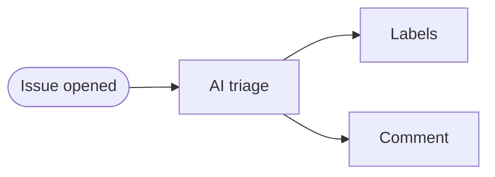

---
title: IssueOps
description: Automate issue triage, categorization, and responses when issues are opened - fully automated issue management
sidebar:
  badge: { text: 'Event-triggered', variant: 'success' }
---

IssueOps transforms GitHub issues into automation triggers that analyze, categorize, and respond to issues automatically. Use it for auto-triage, smart routing, initial responses, and quality checks. GitHub Agentic Workflows makes this natural through [issue triggers](/gh-aw/reference/triggers/) and [safe-outputs](/gh-aw/reference/safe-outputs/) that handle automated responses securely without write permissions for the main AI job.

When issues are created, workflows activate automatically. The AI analyzes content and provides intelligent responses through automated comments.

## Example: Issue Triage Assistant

This workflow responds to new issues with contextual guidance. It analyzes the title and description for bug reports needing information, feature requests to categorize, questions to answer, or potential duplicates. The AI then comments with helpful next steps or immediate assistance.



Example workflow:

```aw wrap title=".github/workflows/issue-triage.md"
---
on:
  issues:
    types: [opened]

permissions:
  contents: read
  actions: read

safe-outputs:
  add-comment:
    max: 2
---

# Issue Triage Assistant

Analyze new issue content and provide helpful guidance. Examine the title and description for bug reports needing information, feature requests to categorize, questions to answer, or potential duplicates. Respond with a comment guiding next steps or providing immediate assistance.
```

This creates an intelligent triage system that responds to new issues with contextual guidance.

## Organizing Work with Sub-Issues

Break large work into agent-ready tasks using parent-child issue hierarchies. Create hierarchies with the `parent` field and temporary IDs, or link existing issues with `link-sub-issue`:

```aw wrap
---
on:
  command:
    name: plan

safe-outputs:
  create-issue:
    title-prefix: "[task] "
    max: 6
---

# Planning Assistant

Create a parent tracking issue, then sub-issues linked via parent field:

{"type": "create_issue", "temporary_id": "aw_abc123", "title": "Feature X", "body": "Tracking issue"}
{"type": "create_issue", "parent": "aw_abc123", "title": "Task 1", "body": "First task"}
```

## Related Documentation

- [ChatOps](/gh-aw/patterns/chat-ops/) — Interactive slash command automation
- [LabelOps](/gh-aw/patterns/label-ops/) — Label-triggered automation
- [WorkQueueOps](/gh-aw/patterns/workqueue-ops/) — Sequential queue processing
- [ResearchPlanAssignOps](/gh-aw/patterns/research-plan-assign-ops/) — Research → Plan → Assign
- [Safe Outputs](/gh-aw/reference/safe-outputs/) — Secure write operations
- [GitHub Tools](/gh-aw/reference/github-tools/) — GitHub API toolsets
- [Concurrency](/gh-aw/reference/concurrency/) — Prevent race conditions
- [Cache Memory](/gh-aw/reference/cache-memory/) — Persistent state across runs

