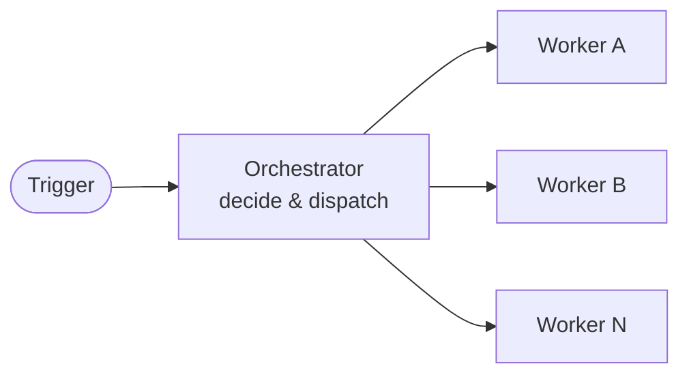

---
title: OrchestratorOps
description: Coordinate multiple agentic workflows using an orchestrator/worker pattern — one workflow decides what to do, dispatches workers to do the concrete work.
sidebar:
  badge: { text: 'Multi-step', variant: 'caution' }
---

OrchestratorOps is a pattern where one workflow (the **orchestrator**) fans out work to one or more **worker** workflows. The orchestrator decides what to do and in what order; workers execute concrete tasks with scoped permissions and tools. This keeps complex multi-step operations manageable, observable, and independently resumable.



## When to Use OrchestratorOps

Use OrchestratorOps when a single workflow run is too coarse — the work spans multiple repositories, requires different tools or permissions per step, benefits from parallel execution, or needs intermediate human review between phases. Common cases include multi-repo rollouts, phased dependency upgrades, and initiative-level automation that touches many issues or PRs.

## The Orchestrator/Worker Pattern

- **Orchestrator**: decides what to do next, splits work into units, dispatches workers.
- **Worker(s)**: do the concrete work (triage, code changes, analysis) with scoped permissions and tools.
- **Optional monitoring**: both orchestrator and workers can update a GitHub Project board for visibility.

## Dispatch Workers with `dispatch-workflow`

Allow dispatching specific workflows via GitHub's `workflow_dispatch` API:

```yaml
safe-outputs:
  dispatch-workflow:
    workflows: [repo-triage-worker, dependency-audit-worker]
    max: 10
```

During compilation, gh-aw validates the target workflows exist and support `workflow_dispatch`. Workers receive a JSON payload and run asynchronously as independent workflow runs.

See [`dispatch-workflow` safe output](/gh-aw/reference/safe-outputs/#workflow-dispatch-dispatch-workflow).

## Call Workers with `call-workflow`

Call reusable workflows (`workflow_call`) via compile-time fan-out — no API call at runtime:

```yaml
safe-outputs:
  call-workflow:
    workflows: [spring-boot-bugfix, frontend-dep-upgrade]
    max: 1
```

The compiler validates that each worker declares `workflow_call`, generates a typed MCP tool per worker from its inputs, and emits a conditional `uses:` job. At runtime the worker whose name the agent selected executes as part of the same workflow run — preserving `github.actor` and billing attribution.

See [`call-workflow` safe output](/gh-aw/reference/safe-outputs/#workflow-call-call-workflow).

Use `call-workflow` when actor attribution matters, workers must finish before the orchestrator concludes, or you want zero API overhead. Use `dispatch-workflow` when workers should run asynchronously, outlive the parent run, or need `workflow_dispatch` inputs.

## Passing Correlation IDs

If your workers need shared context, pass an explicit input such as `tracker_id` (string) and include it in worker outputs (e.g., writing it into a Project custom field).

## Related Documentation

- [BatchOps](/gh-aw/patterns/batch-ops/) — Parallel processing of large item volumes
- [MultiRepoOps](/gh-aw/patterns/multi-repo-ops/) — Central control plane pattern (orchestrator + worker across repos)
- [WorkQueueOps](/gh-aw/patterns/workqueue-ops/) — Sequential processing with ordering guarantees
- [Safe Outputs (`dispatch-workflow`)](/gh-aw/reference/safe-outputs/#workflow-dispatch-dispatch-workflow) — Dispatching workers
- [Safe Outputs (`call-workflow`)](/gh-aw/reference/safe-outputs/#workflow-call-call-workflow) — Calling reusable workflows
- [Monitoring with Projects](/gh-aw/experimental/monitoring-with-projects/) — Tracking orchestrator/worker progress
