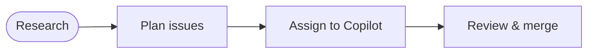

---
title: ResearchPlanAssignOps
description: Orchestrate deep research, structured planning, and automated assignment to drive AI-powered development cycles from insight to merged PR
sidebar:
  badge: { text: 'Multi-phase', variant: 'caution' }
---

ResearchPlanAssignOps is a four-phase development pattern that moves from automated discovery to merged code with human control at every decision point. A research agent surfaces insights, a planning agent converts them into actionable issues, a coding agent implements the work by [assigning issues to GitHub Copilot](/gh-aw/reference/copilot-cloud-agent/), and a human reviews and merges.

## The Four Phases



Each phase produces a concrete artifact consumed by the next, and every transition is a human checkpoint.

### Phase 1: Research

A scheduled workflow investigates the codebase from a specific angle and publishes its findings as a GitHub discussion. The discussion is the contract between the research phase and everything that follows—it contains the analysis, recommendations, and context a planner needs.

The [`go-fan`](https://github.com/github/gh-aw/blob/main/.github/workflows/go-fan.md) workflow is a live example: it runs each weekday, picks one Go dependency, compares current usage against upstream best practices, and creates a `[go-fan]` discussion under the `audits` category.

```aw wrap
---
name: Go Fan

on:
  schedule: daily on weekdays
  workflow_dispatch:

engine: claude

safe-outputs:
  create-discussion:
    title-prefix: "[go-fan] "
    category: "audits"
    max: 1
    close-older-discussions: true

tools:
  cache-memory: true
  github:
    toolsets: [default]
---

Analyze today's Go dependency. Compare current usage in this
repository against upstream best practices and recent releases.
Save a summary to scratchpad/mods/ and create a discussion
with findings and improvement recommendations.
```

The research agent uses `cache-memory` to track which modules have been reviewed so it rotates through them systematically across runs.

### Phase 2: Plan

After reading the research discussion, a developer triggers the `/plan` command on it. The [`plan`](https://github.com/github/gh-aw/blob/main/.github/workflows/plan.md) workflow reads the discussion, extracts concrete work items, and creates up to five sub-issues grouped under a parent tracking issue.

```
/plan focus on the quick wins and API simplifications
```

The planner formats each sub-issue for a coding agent: a clear objective, the files to touch, step-by-step implementation guidance, and acceptance criteria. Issues are tagged `[plan]` and `ai-generated`.

> [!TIP]
> The `/plan` command accepts inline guidance. Steer it toward high-priority findings or away from lower-priority ones before it generates issues.

### Phase 3: Assign

With well-scoped issues in hand, the developer [assigns them to Copilot](https://docs.github.com/en/copilot/how-tos/use-copilot-agents/coding-agent/create-a-pr#assigning-an-issue-to-copilot) for automated implementation. Copilot opens a pull request and posts progress updates as it works.

Issues can be assigned individually through the GitHub UI, or pre-assigned in bulk via an orchestrator workflow:

```aw wrap
---
name: Auto-assign plan issues to Copilot

on:
  issues:
    types: [labeled]

engine: copilot

safe-outputs:
  assign-to-user:
    target: "*"
  add-comment:
    target: "*"
---

When an issue is labeled `plan` and has no assignee,
assign it to Copilot and add a comment indicating
automated assignment.
```

For multi-issue plans, assignments can run in parallel—Copilot works independently on each issue and opens separate PRs.

### Phase 4: Merge

Copilot's pull request is reviewed by a human maintainer. The maintainer checks correctness, runs tests, and merges. The tracking issue created in Phase 2 closes automatically when all sub-issues are resolved.

## End-to-End Example

A full cycle driven by `go-fan`:

- **Monday 7 AM** — `go-fan` posts a discussion *"[go-fan] Go Module Review: spf13/cobra"* recommending context propagation via cobra's `SetContext` and shared setup via `PersistentPreRunE`.
- **Monday afternoon** — A developer types `/plan` on the discussion. The planner opens a `[plan] cobra improvements` tracking issue with three sub-issues (context propagation, `PersistentPreRunE` refactor, cancellation tests), then assigns the first two to Copilot, which opens PRs within minutes.
- **Tuesday** — The developer reviews the PRs, requests one minor change, and merges both. The tracking issue closes automatically.

## Workflow Configuration Patterns

The Phase 1 example already shows the core research config (`create-discussion` with `close-older-discussions: true`, plus `cache-memory`). Two more safe-output knobs shape the later phases.

### Plan: group sub-issues

`group: true` creates the parent tracking issue automatically—do not create it manually:

```aw wrap
safe-outputs:
  create-issue:
    expires: 2d
    title-prefix: "[plan] "
    labels: [plan, ai-generated]
    max: 5
    group: true
```

### Assign: skip planning with `assignees`

When research produces self-contained, well-scoped issues, assign directly and skip the manual plan phase—as `duplicate-code-detector` does for narrow duplication fixes:

```aw wrap
safe-outputs:
  create-issue:
    title-prefix: "[fix] "
    labels: [ai-generated]
    assignees: copilot
```

## Customization

Adapt the pattern by varying the **research focus** (static analysis, performance, documentation quality, security, code duplication, test coverage), the **frequency** (daily, weekly, on-demand), the **report format** (discussions for open-ended findings, issues for self-contained tasks), and the **assignment method** (pre-assign in the research workflow, bulk-assign via an orchestrator, or assign individually through the GitHub UI).

## Limitations

The multi-phase approach takes longer than direct execution and requires developers to review research reports and generated issues. Research agents may surface findings that don't require action (false positives), and each phase transition needs clear handoffs. Research agents often require specialized MCPs (Serena, Tavily, etc.) for deeper analysis.

## When to Use ResearchPlanAssignOps

This pattern fits when:

- The scope of work is unknown until analysis runs
- Issues need human prioritization before implementation
- Research findings vary in quality (some runs find nothing actionable)
- Multiple work items can be executed in parallel

Prefer a simpler pattern when:

- The work is already well-defined (use [IssueOps](/gh-aw/patterns/issue-ops/))
- Issues can go directly to Copilot without review (use the `assignees: copilot` shortcut in your research workflow)
- Work spans multiple repositories (use [MultiRepoOps](/gh-aw/patterns/multi-repo-ops/))

## Existing Workflows

| Phase | Workflow | Description |
|-------|----------|-------------|
| Research | [`go-fan`](https://github.com/github/gh-aw/blob/main/.github/workflows/go-fan.md) | Daily Go dependency analysis with best-practice comparison |
| Research | [`copilot-cli-deep-research`](https://github.com/github/gh-aw/blob/main/.github/workflows/copilot-cli-deep-research.md) | Weekly analysis of Copilot CLI feature usage |
| Research | [`static-analysis-report`](https://github.com/github/gh-aw/blob/main/.github/workflows/static-analysis-report.md) | Daily security scan with clustered findings |
| Research | [`duplicate-code-detector`](https://github.com/github/gh-aw/blob/main/.github/workflows/duplicate-code-detector.md) | Daily semantic duplication analysis (auto-assigns) |
| Plan | [`plan`](https://github.com/github/gh-aw/blob/main/.github/workflows/plan.md) | `/plan` slash command—converts issues or discussions into sub-issues |
| Assign | GitHub UI / workflow | [Assign issues to Copilot](https://docs.github.com/en/copilot/how-tos/use-copilot-agents/coding-agent/create-a-pr#assigning-an-issue-to-copilot) for automated PR creation |

## Related Documentation

- [DispatchOps](/gh-aw/patterns/dispatch-ops/) — Manually triggered research and one-off investigations
- [WorkQueueOps](/gh-aw/patterns/workqueue-ops/) — Sequential queue processing for large backlogs
- [Safe Outputs](/gh-aw/reference/safe-outputs/) — Secure write operations
- [Copilot Cloud Agent](/gh-aw/reference/copilot-cloud-agent/) — Assigning issues to GitHub Copilot
